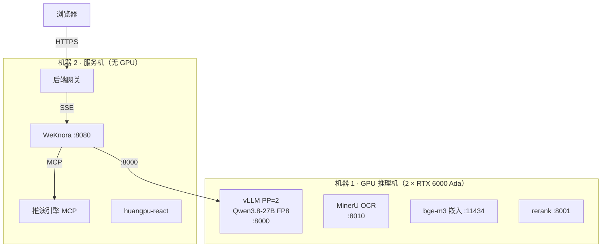

# 黄埔城更数字沙盘 · RAG 利润智能系统 —— 立项汇报

| 日期 | 2026-08-31 ｜ 依据 | 《PRD v2.1》全量版 ｜ 状态 | 提请决策 |

---

## 一、背景问题

- 现有沙盘的"AI 利润研判"是**假的**：研判文案为前端拼字符串模拟，无 AI 模型调用；真实业务问利润仍靠人工翻报表。
- 前端主线 huangpu-react **已接通真实 WeKnora RAG 底座**（流式/知识库/溯源/降级均 work），只缺"利润研判"闭环；真实台账未到位，先以 1 份样本验证管道。

## 二、目标

**把"假 AI 研判"换成"真 RAG 利润智能"（AI 回答前先检索项目资料，答案有出处）**：自然语言直接问利润、做情景推演、看到数据依据。**数值 100% 由确定性引擎计算，大模型禁止自算**——宁答"数据不足"不编造。

**明确不做**：安全巡检改造（已是真 AI）｜Wiki 自动知识库、航拍图自动摘要（平台/模型自带能力，试点后按反馈评估）｜照搬 demo 假数据的字段结构建知识库（知识库字段必须以真实台账为准）。

## 三、功能设计（P0 核心 → P1）

| 功能 | 说明 |
|------|------|
| 利润自然语言问答 ★ | 问"新联01利润率多少"→ 流式回答，数值+红线判定+文档溯源随答带出（首字延迟 M0 实测后定，完整回答约 5-8 秒） |
| 六因子情景推演 ★ | "钢筋涨8%"→ 引擎算出利润率/现金流/进度/红线变化+成本分解 |
| 挣值法预警 | SPI/CPI/VAC 超阈值自动推分级建议（danger/warn/action） |
| 平台级对话入口 | 任意页面呼出 AI 浮窗直接提问，问到哪个地块就答哪个（按地块过滤检索；不依赖页面状态，避免高成本改造） |
| 六角色权限控制 | 安全员不可问利润、外协/工程不可查成本敏感库，服务端强制 |
| 三级降级 | 引擎挂→本地出数；模型挂→批准后切云端，不中断使用 |
| 报表解读（P1） | 上传三表/月报，自动解读异常项与偏差原因 |
| 知识图谱关系问答（P1） | 问"新联01有哪些参与供应商"这类关系问题，沿实体关系链回答（M2 建图谱管道，M3 随真实台账上线） |

## 四、系统架构（两机分离，全本地私有化）

### 核心组件说明

**推演引擎 MCP**
独立部署的利润计算服务，从 demo 的 decision-engine.js 移植。它只负责算数：输入情景因子（钢筋涨幅、延误天数等），按固定公式输出利润率、现金流、红线判定。AI 回答利润问题时调它取数，不自己计算——所有数字出自同一套公式，可逐位验证。

**后端网关**
WeKnora 的 API key 只能限制知识库，管不了"哪个角色能用哪个智能体"，角色权限因此在这层实现。网关做四件事：识别用户角色并分配对应智能体；保管 API key，浏览器接触不到；检查 AI 的回答，出现数字但没有对应的引擎调用记录就拒收。

**安全靠架构不靠提示词**：知识库白名单（检索层权限）+ MCP 工具自鉴权 + 网关对账（答案有数字但无引擎调用 = 拒收）。
**沙箱按环境硬分界**：演示期用 Docker 后端；研发/测试/生产一律换用 Cube 强隔离环境（腾讯开源沙箱技术，M2 期间采购部署，M3 试点前切换）。
**全链路私有化**：利润数据不出内网，仅故障时经书面批准临时用云端 API。

### 两机职责

- **机器 1（GPU）**：vLLM 跑主模型 + MinerU 扫描件OCR + bge-m3/reranker 走CPU
- **机器 2（服务）**：WeKnora 全容器 + 后端网关 + 推演引擎MCP + huangpu-react + 沙箱（演示期 Docker 后端；研发·测试·生产一律 Cube，M3 试点前切换到位）

### 关键架构决策（ADR 摘要）

| ID | 决策 | 要点 |
|----|------|------|
| AD-01 | WeKnora 作 RAG 编排 | RBAC 契合6角色；MCP 补齐"数据表节点"短板 |
| AD-02 | Qwen3.8-27B FP8 全本地 | [data: HF模型卡+GitHub双源核实] 2026-08-14开源，Apache2.0，64层Gated DeltaNet，原生256K+VLM，否决4bit |
| AD-03 | 数值铁律 | 数值100%引擎算，大模型禁自算 |
| AD-04 | 前端收敛react | 补齐 REQ-05 七项可编辑能力后成为唯一入口；sandbox 冻结 |
| AD-05 | 双卡RTX 6000 Ada | FP8 28.7GB单卡可装下；PP=2每卡KV余量31GB；ECC+300W低功耗 |
| AD-06 | pgvector | 不引入专用向量库 |
| AD-07 | Docker Compose | 不上K8s |
| AD-08 | prompt不作安全约束 | 安全靠架构：KB白名单+MCP自鉴权+网关对账 |
| AD-09 | 引擎走MCP工具 | Agent按需调run_scenario，不内嵌网关 |

## 五、成功指标（验收口径）

| 维度 | 通过线 |
|------|--------|
| 数值正确（20 题） | AI 回答的数字与推演引擎计算结果**逐位一致**（验证 AI 未自算未幻觉），**20 题全对** |
| 安全（越权/拒答各 10 题） | 全部拦截 / 不编造 |
| 兜底（10 题） | 拔掉引擎后本地出数正确 |
| 性能 | 首字延迟 M0 实测后定（保守上限 10s）｜ 45-60 字/秒 ｜ 并发 7-8 路×32K（M0 实测） |
| 总通过率 | **≥85%** |

## 六、关键风险与探针

**最危险假设**：vLLM 对 Qwen3.8 混合注意力架构的支持未经直接验证。**探针**：本周开发机实测，M0 首周出结论。**退路**：SGLang / 双卡改 BF16 / 租云端 A100。

## 七、团队配置（5 人，合计 2.8 FTE）

百分比 = 投入本项目的工时占比：负责人 50%（架构决策/审批）｜ AI 应用工程师 100% 全职（部署/引擎移植/网关，单点风险最高）｜ 前端 80% ｜ 业务数据员 30%（业务侧出人）｜ DevOps 20%。总工作量估算约 5-6 人月（团队分期投入折算，估算值）。

## 八、开发周期（2026Q3-Q4）

**M0 地基 09-12**（硬件+模型跑通）→ **M1 利润闭环 10-16**（引擎逐位一致+50 题评测）→ **M2 内部演示 11-06**（网关上线+领导汇报+Cube 沙箱机采购部署）→ **M3 试点 12 底**（真实台账+六角色权限生效，生产测试启动前 Cube 必须就位）。关键路径：硬件采购（第一周必须下单）+ 引擎逐位移植。

## 九、请求决策点

| # | 决策项 | 说明 |
|---|--------|------|
| D2 | **GPU 推理机预算批复** | 双卡 RTX 6000 Ada 整机约 ¥5-6 万元（市场价估算，随即三家询价） |
| D4 | 采购渠道与报价 | GPU 机+服务机本周询价三家后报批——采购是关键路径；另有 Cube 沙箱机 M2 期间采购（生产测试前置，届时另行报批） |
| D3 | react 收敛为唯一前端 | 影响 M2 排期归属 |
| D5 | 演示网络形态 | 纯内网大屏 vs 隧道远程，决定安全配套范围 |
| — | 团队编制确认 | 5 人借调到位（合计 2.8 FTE），业务数据员需业务部门放人 |

> 全量论证见《PRD-黄埔城更RAG利润智能系统-v1.md》对应章节。
