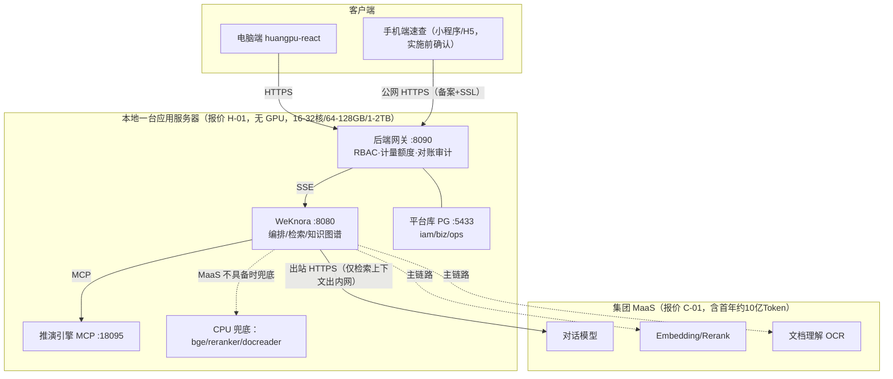

# 黄埔城更 AI 助手平台（数字沙盘 · RAG 利润智能）—— 立项汇报

| 日期 | 2026-09-20（v3 MaaS 平台版）｜ 依据 | 《PRD v3.0》《系统架构 v2.0》《数据结构 v1.0》《成本估算 v5.0》、集团《对外报价清单 v0.4（MaaS 版）》｜ 状态 | 提请决策 |

> v3 变更：模型层由本地双卡 vLLM 切换为**集团 MaaS**（报价 C-01，含首年约 10 亿 Token，无自建 GPU）；范围由"利润专项 RAG"扩展为**平台底座＋首批业务助手**（对齐报价 A–F 共 23 科目、总价 290 万）；新增 Token 额度管控、AI 助手门户、平台管理（账号/用量）、手机端速查、培训实施。自托管双卡/云租降为备选 R-B。

---

## 一、背景问题

- 现有沙盘的"AI 利润研判"是**假的**：研判文案为前端拼字符串模拟，无 AI 模型调用；真实业务问利润仍靠人工翻报表。
- 前端主线 huangpu-react **已接通真实 WeKnora RAG 底座**（流式/知识库/溯源/降级均 work），只缺"利润研判"闭环；真实台账未到位，先以 1 份样本验证管道。

## 二、目标

**把"假 AI 研判"换成"真 RAG 利润智能"（AI 回答前先检索项目资料，答案有出处）**：自然语言直接问利润、做情景推演、看到数据依据。**数值 100% 由确定性引擎计算，大模型禁止自算**——宁答"数据不足"不编造。

**明确不做**：安全巡检改造（已是真 AI）｜Wiki 自动知识库、航拍图自动摘要（平台/模型自带能力，试点后按反馈评估）｜照搬 demo 假数据的字段结构建知识库（知识库字段必须以真实台账为准）。

## 三、功能设计（P0 核心 → P1）

| 功能 | 说明 |
|------|------|
| 利润自然语言问答 ★ | 问"新联01利润率多少"→ 流式回答，数值+红线判定+文档溯源随答带出（首字延迟 M0 实测后定，完整回答约 5-8 秒） |
| 六因子情景推演 ★ | "钢筋涨8%"→ 引擎算出利润率/现金流/进度/红线变化+成本分解 |
| 挣值法预警 | SPI/CPI/VAC 超阈值自动推分级建议（danger/warn/action） |
| AI 助手门户＋首批业务助手 ★ | 统一门户 /assistants：利润财务（核心）、商务合约、工程进度、安全、资料档案 5 个助手，绑定知识库与角色，场景清单 M1 冻结（报价 B-01/B-03） |
| 六角色权限控制 | 安全员不可问利润、外协/工程不可查成本敏感库，服务端强制（RBAC 三约束，F-01） |
| Token 计量与额度管控 | 全链路计量、70/90/100% 阈值告警、超额熔断（只读检索＋引擎数值可用），用量看板可下钻（C-03） |
| 五级降级与兜底 | 引擎挂→本地出数；MaaS 故障→备用端点；额度熔断→只读；自托管 R-B 为最终备选，不中断使用 |
| 平台管理（P1） | 账号角色管理、登录审计、用量看板（F-01/C-03） |
| 手机端速查（P1） | 管理层只读：指标卡/单项目速查/AI 问答；小程序推荐、H5 备选，实施前确认（A-02） |
| 报表解读（P1） | 上传三表/月报，自动解读异常项与偏差原因（B-02 通用能力） |
| 知识图谱关系问答（P1） | 问"新联01有哪些参与供应商"这类关系问题，沿实体关系链回答（M2 建图谱管道，M3 随真实台账上线） |

## 四、系统架构（单台应用服务器＋集团 MaaS，数据内网、模型上移）

### 核心组件说明

**推演引擎 MCP**
独立部署的利润计算服务（Node MCP，与前端演示算法同源单源）。它只负责算数：输入情景因子（钢筋涨幅、延误天数等），按固定公式输出利润率、现金流、红线判定。AI 回答利润问题时调它取数，不自己计算——所有数字出自同一套公式，可逐位验证。

**后端网关（v3 六项职责）**
RBAC 角色权限（知识库/智能体/利润三约束）；密钥保管（浏览器不接触 WeKnora/MaaS key）；输出对账（有数字但无引擎调用即拒收）；**Token 计量与额度熔断（70/90/100%）**；审计落盘；平台库读写（账号/台账基线/用量）。

**集团 MaaS**：对话/Embedding/Rerank/文档理解四槽位优先走 MaaS（OpenAI 兼容），bge/docreader CPU 兜底；不含自建推理 GPU。仅检索上下文（含片段，不含台账全量库）经集团合规通道出内网。

**安全靠架构不靠提示词**：知识库白名单（检索层权限）+ MCP 工具自鉴权 + 网关对账（答案有数字但无引擎调用 = 拒收）。
**沙箱按环境硬分界**：演示期用 Docker 后端；研发/测试/生产一律换用 Cube 强隔离环境（M2 期间部署，M3 试点前切换）。
**数据边界**：知识库/台账/图谱/账号全留内网；模型上移集团 MaaS；自托管 vLLM（云租/双卡）为备选路线 R-B，故障或额度风险经书面批准启用。

### 部署职责（单机＋云服务）

- **本地应用服务器（H 类，约 8 万代收代付）**：WeKnora 全容器＋网关＋引擎 MCP＋平台库 PG＋huangpu-react＋CPU 兜底容器＋Cube 沙箱（M3 前切换）
- **集团 MaaS（C 类）**：四类模型能力，首年约 10 亿 Token；无 GPU 采购、无云租金

### 关键架构决策（ADR 摘要）

| ID | 决策 | 要点 |
|----|------|------|
| AD-01 | WeKnora 作 RAG 编排 | RBAC 契合6角色；MCP 补齐"数据表节点"短板 |
| AD-02（v3 修订） | 模型走集团 MaaS | 四槽位（对话/嵌入/重排/文档理解）优先 MaaS、CPU 兜底；Qwen3.8-27B FP8 自托管降为 R-B |
| AD-03 | 数值铁律 | 数值100%引擎算，大模型禁自算（不变，报价 B-03 核心交付） |
| AD-04 | 前端收敛react | 电脑端唯一入口；手机端为独立只读速查（A-02）；sandbox 冻结 |
| AD-05（v3 修订） | 无自建 GPU，单台应用服务器 | 报价 H-01 16–32核/64–128GB/1–2TB；双卡 RTX 6000 Ada/云租存档 R-B1/B2 |
| AD-06 | pgvector | 不引入专用向量库；另设平台库 PG 5433（iam/biz/ops） |
| AD-07 | Docker Compose | 不上K8s |
| AD-08 | prompt不作安全约束 | 安全靠架构：KB白名单+MCP自鉴权+网关对账 |
| AD-09 | 引擎走MCP工具 | Agent按需调run_scenario，不内嵌网关 |
| AD-10（v3 新增） | Token 计量与熔断 | 全链路计量、70/90/100% 阈值、超额只读（C-03） |
| AD-11（v3 新增） | 平台化助手 | 统一门户＋首批 5 业务助手，新增助手主要为配置调优（B-01/B-03） |

## 五、成功指标（验收口径）

| 维度 | 通过线 |
|------|--------|
| 数值正确（20 题） | AI 回答的数字与推演引擎计算结果**逐位一致**（验证 AI 未自算未幻觉），**20 题全对** |
| 安全（越权/拒答各 10 题） | 全部拦截 / 不编造 |
| 兜底（10 题） | 拔掉引擎后本地出数正确 |
| 性能 | 首字延迟 M0 对 MaaS 实测后定（保守上限 10s）｜ 45-60 字/秒 ｜ 并发以 MaaS 配额为准（M0 实测） |
| 额度管控 | 用量可查、70/90/100% 阈值动作生效、熔断后检索与引擎数值不中断（M2 演练） |
| 总通过率 | **≥85%** |

## 六、关键风险与探针

**最危险假设（v3）**：集团 MaaS 接口清单不明——是否提供 Embedding/Rerank/文档理解、并发配额、SLA、超额单价均未书面确认；10 亿 Token 按 3 万/问仅约每人每天 4.4 问，可能不够。**探针**：M0 第一周完成开通对接与真实端点/每问 Token 实测。**退路**：缺失槽位 CPU 兜底；额度不足走续通或备选 R-B（云租/双卡/公有云 API）。

## 七、团队配置（5 人，合计 2.8 FTE）

百分比 = 投入本项目的工时占比：负责人约 50%（架构决策/MaaS 对接与合同/审批）｜ AI 应用工程师 2 人（部署/引擎/网关/计量/助手调优，单点风险最高）｜ 前端 1 人全职（瓶颈，含手机端）｜ 产品经理全职（需求/评测/台账/场景清单/培训）｜ DevOps 节点投入。v5.0 估算口径 B 共 **380 人天、人力约 111.75 万**，日历约 6.2 个月（前端瓶颈）；对外报价 290 万，粗算毛利率约 59–62%。

## 八、开发周期（2026Q3-Q4）

**M0 地基 09-12**（应用服务器＋**MaaS 开通对接**＋槽位/计量埋点＋实测）→ **M1 利润闭环 10-16**（引擎逐位一致+50 题评测＋助手场景清单冻结）→ **M2 内部演示 11-06**（网关/门户/用量与账号页＋领导汇报＋Cube 部署）→ **M3 试点 12 底**（真实台账＋六角色权限＋手机端＋培训交付，生产测试启动前 Cube 必须就位）。关键路径：**MaaS 开通与接口清单确认（外部依赖，第一周必须发起）**＋引擎逐位一致；应用服务器采购与之并行。

## 九、请求决策点

| # | 决策项 | 说明 |
|---|--------|------|
| D2（v3） | **集团 MaaS 开通与合同条款** | 接口清单（四槽位）/首年 10 亿 Token 口径/超额单价/SLA/含税与付款/质保续费——M0 第一周发起，外部关键路径 |
| D4（v3） | 应用服务器采购（报价 H 类代收代付约 8 万） | 32核/128GB/2TB 无 GPU＋UPS/备份存储，M0 询价；Cube M2 另行部署 |
| D11（v3） | 手机端形态 | 小程序（推荐，需政务类目资质）还是 H5（快速备选），实施前确认 |
| D12（v3） | 首批 5 业务助手场景清单 | B-03"清单需求确认后定"，M1 需求确认会冻结各域 ≥20 问 |
| D3 | react 收敛为电脑端唯一前端 | 影响 M2 排期归属 |
| D5 | 网络形态 | 电脑端内网；手机端公网 HTTPS（备案＋SSL，暴露面书面批准）；MaaS 出站白名单 |
| — | 团队编制确认 | 前端全职 1 人、AI 工程师 2 人、产品经理全职、负责人/DevOps 兼职，业务侧放数据员 |

> 全量论证见《PRD-黄埔城更RAG利润智能系统-v1.md》对应章节。
