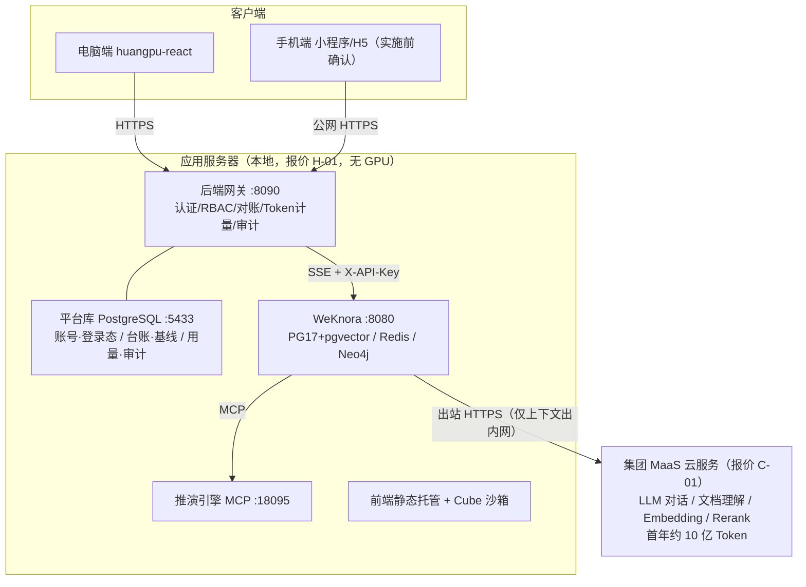
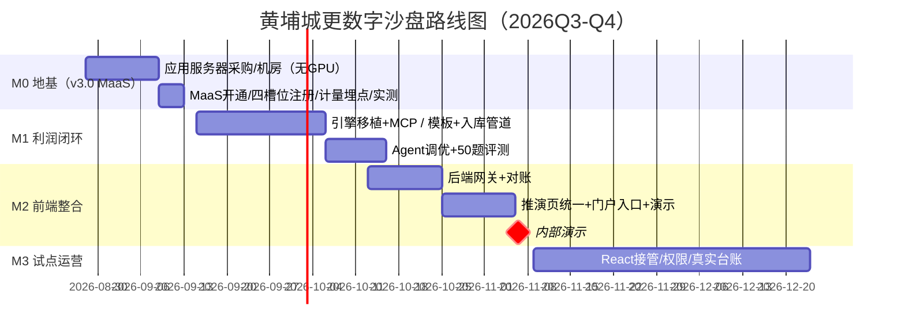

# 黄埔城更 AI 助手平台（数字沙盘 · RAG 利润智能）PRD

| 项目 | 内容 |
|------|------|
| 文档版本 | **v3.0（MaaS 平台版，对齐《对外报价清单 v0.4·集团 MaaS》2026-09-08）**<br>v3.0 变更：模型层主口径切集团 MaaS（C-01，含首年约 10 亿 Token，不自建推理 GPU），自托管 vLLM 降为备选路线 R-B；新增 REQ-12 AI 助手门户与首批业务助手（B-01/B-03）、REQ-13 Token 计量与额度管控（C-03）、REQ-14 培训实施与验收配合（服务说明）、REQ-15 手机端管理层速查（A-02）；新增平台库与数据结构（见《数据结构设计》）；预算指向《成本估算 v5.0》。<br>v2.2（知识图谱检索提级为 P1 早启，REQ-11 关系问答）<br>v2.1（评审报告 4 项 P1 + 6 项 P2 修复）<br>v2.0（需求层为主体，技术论证移入附录） |
| 日期 | 2026-09-20 |
| 状态 | Review（v3.0 提请评审） |
| 编制依据 | huangpu-sandbox / huangpu-react demo 源码审查 + WeKnora 源码核实 + 《黄埔城更 AI 助手平台对外报价清单 v0.4（集团 MaaS）》 |
| 文档定位 | 产品需求文档——定义"做什么"（需求/功能/验收）与"怎么做"（架构约束/团队/周期）。技术实现见《系统架构设计（后端）v2.0》《数据结构设计 v1.0》，报价对照见《官方报价对照评估》。 |
| 事实打标说明 | 正文中方括号标记的含义：**[data: 来源]** = 有源码/官方文档佐证的事实；**[hunch]** = 估算/推断值，非实测；**[assumption: 理由]** = 未经验证的假设；**[NEED: 事项——负责人，期限]** = 待外部输入的缺口。无标记的数字为已核实事实 |

---

## 目录

1. 背景与现状
2. 用户与角色
3. 非目标
4. 功能需求
5. 核心业务逻辑（利润计算依据）
6. 数据需求与治理
7. 系统架构
8. 技术约束（既定决策）
9. 验收标准
10. 异常处理原则
11. 团队配置
12. 开发周期与里程碑
13. 风险登记册
14. 预算汇总
15. 待决策与行动项
16. 开放问题
- 附录 A-G（技术实现细节）

---

## 1. 背景与现状

### 1.1 一句话目标

**把黄埔城更数字沙盘里的"假 AI 研判"换成"真 RAG 利润智能"**——让指挥长/商务部/财务部用自然语言直接问利润、做情景推演、看到数据依据。**利润是唯一核心，其余都是支撑。**

### 1.2 两份 demo

项目目录下有两份 demo，均为**功能参照**（demo 中数据值/字段名/表名为假数据，不代表业务事实）：

| demo | 技术形态 | RAG 接入 | 角色定位 |
|------|---------|---------|---------|
| huangpu-sandbox | 纯静态 HTML+JS+Chart.js | 假 AI（本地拼字符串+打字机） | 功能标准与验收参照，冻结 |
| huangpu-react | React+vite+TypeScript | 已接真实 WeKnora RAG（全链路 work） | 主前端主线，在此基础上补齐利润研判闭环 |

### 1.3 现状结论

- **利润研判是假 AI**：sandbox demo 的 AI 研判是纯前端拼字符串（`app.js:773-790`），无模型调用。需替换为真 RAG。
- **安全巡检是真 AI**：已接 YOLOv8 真实后端（`safety-ai.js:203-232`），保留不动。
- **RAG 底座已完整**：huangpu-react 已完整对接 WeKnora——SSE 流式、会话管理、知识库管理、引用溯源、降级兜底均已实现。本项目核心工作是补齐利润研判闭环（配置 Agent + 启用 MCP 引擎 + 加后端网关 + 统一交互），而非从零搭建 RAG。
- **数据未到位**：真实台账未到位，M1 用 1 份样本验证管道，不照搬 demo 假数据的字段结构建知识库。

> 源码审查详情见附录 E。

### 1.4 对外报价口径与本项目的关系（v3.0 新增）

集团《对外报价清单 v0.4（MaaS 版）》总价 290 万，按"电脑端＋手机端多端应用 / AI 助手与智能体 / 大模型接入与运行环境 / 知识与文件 / 业务应用与数据接入 / 平台支撑与安全运维 / 硬件"七组共 23 个科目报价。本项目是该报价包的**首期落地**，关系如下：

- **平台底座（全量交付）**：统一 AI 助手入口、通用问答与文件能力、知识库与文件管理、账号角色权限、MaaS 接入与调用管控审计、环境部署与备份监控、电脑端与手机端、培训与验收——对应报价 A/C/D/F 组。
- **首批核心业务助手（打包交付，B-03）**：以本项目资产最深的**利润/财务助手**（六因子推演、六红线、三算对比、现金流预警，即 REQ-01~05）为核心，同步打包商务、工程、安全、资料域助手的场景清单、知识库绑定与试运行调优（REQ-12）。报价备注"清单需求确认后定"，故各域助手的具体问题清单在 M1 需求确认会上冻结 [NEED：业务域问题清单——负责人＋业务部门，M1]。
- **业务展示看板与数据接入（按阶段，E 组）**：数字沙盘既有看板页即 E-01 首期；甲方现有系统/表格/接口对接按 E-02 分阶段，M2 先表格/Excel、M3 起按甲方开放程度接系统。
- **硬件（H 组，代收代付）**：本地一台应用服务器（报价建议 16–32 核 / 64–128GB / SSD 1–2TB）＋ UPS/备份存储/网络配件＋首年电费耗材，约 8 万；不含 GPU、不含机房基建。
- **不含项**：甲方机房基建、信创换卡差额、超额 Token（首年约 10 亿额度外另行协商）、长期驻场。

> 23 个科目与本文需求/架构/数据条目的逐项映射，见《官方报价对照评估》映射表；本文新增 REQ-12~15 即补齐映射中发现的范围缺口。

---

## 2. 用户与角色

### 2.1 六类角色

| 角色 | 核心诉求 |
|------|---------|
| 股份领导/指挥长 | 一句话看利润是否过红线，快速决策不用翻报表 |
| 指挥部商务部 | 情景推演、分包变更对利润影响、三算对比 |
| 指挥部财务部 | 现金流预警、回款延迟影响、临界结余 |
| 外协部 | 前期手续风险对利润的传导 |
| 工程技术部 | 进度延误对成本/利润的影响 |
| 安全员 | 本期不涉及利润研判（保留安全巡检） |

### 2.2 用户故事

| 角色 | 用户故事 |
|------|---------|
| 指挥长 | 作为指挥长，我想要在手机/大屏上问"新联01利润率多少"，系统3秒内回答并标注是否过红线，以便我快速决策不用等商务部报数 |
| 商务部 | 作为商务部经理，我想要调一下"钢筋涨8%"看利润率变化，系统自动算出推演结果和成本分解，以便我准备变更签证策略 |
| 财务部 | 作为财务，我想要问"6月现金流够不够"，系统回答当前结余并预警是否低于200万临界值，以便我提前协调回款 |
| 外协部 | 作为外协，我想要问"前期手续延误对利润影响多大"，系统能推演但不显示成本明细，以便我评估风险不越权 |
| 工程技术部 | 作为工程经理，我想要问"主体延误30天的成本增加"，系统算出工期成本和利润率变化，以便我评估赶工必要性 |
| 安全员 | 作为安全员，我不需要利润问答功能，但能用文档管理查安全制度文档 |

### 2.3 典型场景

**场景一：利润问答**
指挥长打开 AI 助手门户 → 进入"利润财务助手"会话 → 输入"新联01利润率多少" → 系统检索成本利润库 + 调引擎计算 → 开口后流式输出（首字延迟无实测数据，M0 实测后定验收线）："新联01地块当前利润率 XX.XX%，未低于16.66%红线"（完整回答约 5-8 秒，打字机 45-60 字/秒）→ 下方显示引用来源（三算对比表·第3行）与额度状态

**场景二：情景推演**
商务部在决策推演页拖动"钢筋单价+8%"滑块 → 点击"生成研判" → 系统调 MCP `run_scenario` → 流式输出利润率变化 + 成本分解 + 红线判定 → 右侧显示思考过程和工具调用时间轴

**场景三：报表解读**
财务上传现金流月报 → 系统解析文档 → 回答"本月回款延迟15天，现金流结余XX万，未触发200万临界垫资；建议关注XX分包回款" → 附引用来源

### 2.4 角色权限矩阵

| 角色 | 利润问答 | 情景推演 | 现金流数据 | 成本三表 | 成本敏感库 | 项目文档 |
|------|---------|---------|-----------|---------|-----------|---------|
| 指挥长 | ✅ | ✅ | ✅ | ✅ | ✅ | ✅ |
| 商务部 | ✅ | ✅ | ✅ | ✅ | ✅ | ✅ |
| 财务部 | ✅ | ✅ | ✅ | ✅ | ✅ | ✅ |
| 外协部 | ✅ | ✅ | ⚠️只读 | ❌ | ❌ | ✅ |
| 工程技术部 | ✅ | ✅ | ❌ | ❌ | ❌ | ✅ |
| 安全员 | ❌ | ❌ | ❌ | ❌ | ❌ | ✅ |

权限在服务端强制（知识库白名单 + Agent 调度），前端 RBAC 仅辅助引导。篡改前端角色无效。

---

## 3. 非目标

本期明确不做的事项及理由。非目标清单作为范围护栏，用于评审与变更控制。

| 不做什么 | 为什么不做 |
|---------|-----------|
| 安全巡检 AI 改造 | 已是真实 AI（YOLOv8 后端），改造无收益，保留为"前端接真实 AI"样板 |
> **RAG 路线澄清（避免与"知识图谱"混淆）**：本项目核心做的是**向量 + 关键词混合检索的 RAG**（BM25 + 向量，RRF 融合，重排后供 AI 基于检索结果回答）——这是 P0 必做的项目本体。**知识图谱检索（GraphRAG）是负责人选择 WeKnora 的理由之一，提级为 P1 早启**：M2 完成图谱 schema 与实体抽取管道（样本验证），M3 随真实台账灌入图谱并上线关系式问答。它不是核心 RAG 的替代，而是叠加在上面的关系式增强。启用依赖真实台账成型（R10 约束）。

| 航拍图自动摘要 | 主模型自带图片理解能力，可对航拍图生成摘要标注。无业务方提出需求，且多模态能力未实测；试点后按业务反馈评估启用 |
| 沙箱代码执行（Cube MicroVM 本期建设） | 沙箱策略按环境性质硬分界：仅纯演示环境允许 Docker/Local 后端；研发、测试、生产一律 Cube（docker.sock 等于宿主机 root，生产测试不可接受）。本期 M0-M2 为内部演示期用 Docker；Cube 机 M2 期间采购部署，M3 试点（生产测试）前完成切换，不在本期建设范围内重复建设 |
| 照搬 demo 假数据的字段结构来建知识库 | demo 字段是编造的，不代表业务真实字段；知识库结构必须等真实台账确认后再定（§6.3） |

> 系统边界的完整信任/网络/数据边界划分见附录 C。

---

## 4. 功能需求

### 4.0 优先级

| 级别 | 功能 | 验收口径 |
|------|------|---------|
| P0 | REQ-01~05、REQ-07、REQ-09、REQ-13（额度管控最小版）、REQ-15（手机端登录+速查） | §9 评测集通过；额度看板 M0 可用 |
| P1 | REQ-06、REQ-08、REQ-11、REQ-12（助手门户与首批业务助手打包）、REQ-14（培训实施） | 内部试运行可用，KG 随 M3 真实台账上线；培训随里程碑验收 |
| P2 | Wiki 自动知识库、航拍图自动摘要 | 试点期收集业务反馈后评估启用 |

### REQ-01 利润自然语言问答（P0）

**用户故事**：作为指挥长/商务部/财务部，我想要用自然语言问利润率、红线状态、现金流，系统返回数值和依据，以便不用翻报表快速掌握项目利润状况。

**验收条件**：
- Given 用户已登录且有利润问答权限，When 用户输入"新联01利润率多少"，Then 系统流式回答，首字延迟 M0 实测后定验收线（无实测前不作数字承诺；参考：Agent 链路为两次 LLM 调用串行，秒级到十秒级均可能），利润率数值 + 红线判定 + 引用来源随回答流式带出（完整回答约 5-8 秒）
- Given 用户问的数据不存在，When 系统无法检索到，Then 回答"数据不足"不编造
- Given 20道数值正确性测试题，When 自动化跑批，Then AI 回答中的数值与推演引擎的计算结果逐位一致（每题先跑引擎取标准答案，AI 数字必须与其完全相同——验证 AI 未自算未幻觉，20 题全对）

**技术现状**：RAG 流式链路已 work，但用的是 builtin agent 无利润推演能力。

### REQ-02 六因子情景推演（P0）

**用户故事**：作为商务部，我想要用自然语言说"钢筋涨一成"或拖动因子滑块，系统算出推演结果（利润率/现金流/进度/质量/安全/红线/成本分解），以便评估风险情景下的利润变化。

**验收条件**：
- Given 用户输入"钢筋涨价8%"，When 系统解析为 steelPrice=8 并调引擎，Then 返回利润率变化 + 成本分解 + 红线判定
- Given 5个快捷情景，When 自动化比对，Then AI 回答的推演数值与引擎计算结果逐位一致
- Given 10道自然语言解析题，When 评测，Then 因子值与人工标注一致率 ≥90%

**技术现状**：已有6因子滑块+快捷情景+本地 simulate()，但 AI 研判是单向注入纯文本。

### REQ-03 AI 入口与地块上下文（P0；v3.0 修订：浮窗方案已砍，入口收敛）

**用户故事**：作为任意角色用户，我想从 AI 助手门户按业务域选择助手、或从侧边栏直达 AI 问答、或在推演页内嵌面板提问，以便用最直接的入口获得带出处的回答。

**验收条件**：
- Given 用户打开助手门户，When 选择某业务助手，Then 进入 /ai 会话并预选对应智能体与知识库（卡片按 RBAC 过滤）
- Given 用户问"新联01利润率多少"，When 系统处理，Then 从问题中解析地块并检索回答（地块由自然语言携带，不依赖页面状态）
- Given 用户问题未指明地块，When 系统无法确定，Then 反问"请问问哪个地块"（不做猜测）

**设计取舍（v2.x 已决策，v3.0 沿用）**：**不做全局 AI 浮窗、不做"自动携带当前地块"**——源码核实 react 前端无全局项目状态（各页独立 state、成本页写死单项目、多项目页无当前项目概念），新建全局状态+多页改造需天级投入，收益仅省用户输入地块名几个字；地块名是内部用户日常词汇，自然语言携带成本极低。v3.0 以"助手门户＋侧边栏 /ai＋推演页内嵌面板"三处明确入口替代浮窗（UI §3.7、§4）。检索按地块过滤保留——输入源为 Agent 从问题中解析的地块名 + M1 元数据管道，与前端状态无关。

**技术现状**：已有独立 AI 助手页（#/ai）和推演页内嵌卡片；v3.0 新增助手门户 /assistants（M2.11）。

### REQ-04 决策推演增强——挣值法（P0）

**用户故事**：作为工程/商务部，我想要看到挣值法指标（SPI/CPI/EAC/VAC）和超阈值的预警建议，以便评估进度和成本绩效。

**验收条件**：
- Given 项目当前 SPI < 0.98，When 系统生成研判，Then 自动推送 warn 级建议（"周报跟踪产值"）
- Given 挣值指标，When 与 decision-engine.js calcEarnedValue 比对，Then 逐位一致

**技术现状**：已有本地挣值计算和图表，缺 MCP get_current_status 工具让 AI 调用。

### REQ-05 决策推演页 AI 体验统一（P0）

**用户故事**：作为商务部，我想要在推演页看到的 AI 研判结果和主对话页一样——有 Markdown 格式、有引用来源、有思考过程、有工具调用展示，以便研判结果可读可信。

**验收条件**：
- Given 推演页 AI 研判输出，When 展示，Then 支持 Markdown 渲染 + 引用 Tag + 思考面板 + 工具调用时间轴（与 AiAssistant.tsx 一致）
- Given huangpu-react 全面接管 sandbox，When 核对可编辑能力清单，Then 以下 7 处全部完成：①证照表编辑 ②设计进度表编辑 ③成本 Tab 三表编辑 ④安全巡检表编辑 ⑤WBS 与里程碑编辑 ⑥现金流明细面板编辑 ⑦供应商默认编辑态

> 7 处清单来源：原《项目1-vs-项目2-对比与对齐计划》（已删除，内容恢复自项目决策记录）。7 个模块均已在 huangpu-sandbox 源码中核实存在（证照表/设计管控/成本三表/安全巡检/进度甘特/现金流/供应商）。

**技术现状**：DecisionSystem.tsx:570-573 用 aiText 纯文本渲染，未接入 MarkdownView/ThinkingPanel/引用 Drawer。

### REQ-06 报表解读（P1）

**用户故事**：作为财务/商务部，我想要上传成本三表或现金流月报，系统用自然语言解读异常项和偏差原因，以便快速发现风险不用逐行看表。

**验收条件**：
- Given 1份真实台账样本，When 系统解读，Then 至少指出3个异常项并与人工解读一致

**技术现状**：附件上传已实现，无报表解读能力。

### REQ-07 角色权限控制（P0）

**用户故事**：作为项目负责人，我想要安全员无法访问利润问答、外协/工程无法查成本敏感数据，以便保障利润数据不越权泄漏。

**验收条件**：
- Given 安全员账号，When 调用利润问答，Then 返回"无权限"
- Given 外协部账号，When 查成本三表明细，Then 返回"数据不足"
- Given 10道越权测试题，When 跑批，Then 全过
- Given 篡改前端角色，When 调用 API，Then 服务端拒绝（权限在网关强制）

**技术现状**：前端 RBAC 已实现，但 apiKey 进浏览器 bundle + 角色可篡改，需升级为后端网关。

### REQ-08 文档溯源问答（P1）

**用户故事**：作为任意角色，我想要 AI 回答的每个数值都能点击查看来源文档，以便核实数据来源可信。

**验收条件**：
- Given 数值题答案，When 检查，Then 附带 ≥1 条文档引用
- Given 点击引用，When 跳转，Then 定位到原始文档对应位置

**技术现状**：引用溯源双通道已实现，渲染为 Tag 行 + 详情 Drawer。

### REQ-09 降级与兜底（P0，v3.0 按 MaaS 口径修订）

**用户故事**：作为用户，我想要在 MaaS 或 AI 服务出问题、额度用尽时仍能拿到数值答案或明确提示，而不是看到报错页面，以便不中断工作。

**验收条件**：
- Given MCP 引擎不可用，When 用户问数值，Then 网关本地引擎出数（与 MCP 同源零漂移），裁决与兜底答案留痕
- Given MaaS 服务故障/网络不通，When 需 LLM 回答，Then 按预案切换备用 OpenAI 兼容端点（须书面批准，WeKnora 槽位配置级切换）
- Given 年度/月度 Token 额度用尽且未续通，When 用户发起生成式问答，Then 熔断为"只读知识库检索＋本地引擎数值问答"，页面显式红色额度提示，不产生静默失败
- Given 各级别各演练一次（正常/引擎故障/MaaS 故障/额度熔断/RAG 整体不可用），When 验证，Then 全部按架构 §4.5 行为闭环，且 RBAC 与对账不降级

**技术现状**：RAG 失败本地兜底已实现（前端 `chat-service.ts`，生产以网关兜底为准）；MaaS 接入、额度熔断为 v3.0 新增目标；自托管 vLLM 作为备选路线 R-B 存档（架构附录 H）。

> react demo 已知缺陷修复（超时误判/apiKey注入/建会话重复/clearTimeout）不是产品需求，已移至 §12.1 WBS 任务组（M2.0），验收随 M2 网关上线一并执行。

### REQ-11 知识图谱关系问答（P1，M3 随真实台账上线）

**用户故事**：作为商务部/指挥长，我想要问关系型问题（"新联01有哪些参与供应商""这个地块的合同变更链"），系统沿实体关系链回答并展示关系路径，以便看到单篇文档看不见的项目关系全貌。

**验收条件**：
- Given 真实台账首批入库且图谱已建，When 用户问"新联01有哪些参与供应商"，Then 沿地块-项目-供应商关系链回答并标注路径
- Given 图谱未建或不完整，When 用户问关系型问题，Then 回答"关系数据未就绪"不编造关系
- Given 关系数据与台账一致，When 抽查 5 条关系，Then 与真实台账逐条匹配

**启用依赖**：真实台账成型（供应商/合同/分包数据），R10 约束下 M3 随首批数据灌入图谱。M2 先行完成图谱 schema 设计与实体抽取管道（样本验证）。

**技术现状**：WeKnora 平台自带知识图谱能力（Neo4j + 实体抽取，源码已核实）；图谱功能与文档入库共用同一批数据源。

### REQ-12 AI 助手门户与首批业务助手打包（P1，对应报价 B-01/B-02/B-03/B-04）

**用户故事**：作为指挥部各业务域用户，我想要一个统一的 AI 助手入口，进入后看到与我岗位相关的业务助手（利润财务、商务合约、工程进度、安全、资料档案等），每个助手绑定对应知识库与工具、按统一范式回答并给出来源，而不是面对一个笼统的聊天框。

**验收条件**：
- Given 用户登录电脑端或手机端，When 打开 AI 助手门户，Then 看到其角色可见的助手列表（名称、职责一句话、绑定知识库范围），选择后进入该助手会话；RBAC 三约束（知识库/智能体/利润权限）在服务端生效
- Given 首批打包范围，When M1 需求确认会冻结清单，Then 至少包含：利润/财务助手（REQ-01~05 全部能力，六库中成本/现金流/合同库＋引擎 MCP）、商务合约助手（三算对比、分包变更、合同条款检索）、工程进度助手（延误/EVM/工序资料）、安全助手（安全制度检索与巡检记录查询，不含利润）、资料档案助手（项目文档/规范库检索与文件管理联动）
- Given 每个业务助手，When 试运行（B-04 场景调优），Then 有不少于 20 个该域典型问题的场景清单与通过记录，回答遵循统一引用溯源与拒答规则
- Given 通用能力（B-02：文档总结、要点提取、报表解读、多轮追问），When 在任意助手内使用，Then 行为一致

**技术现状**：WeKnora 已具备多智能体与知识库绑定能力，六角色智能体与 prompt 模板已有设计；本需求的增量是门户化 UI、助手清单的产品化注册、各域知识库与场景清单的建设（主要是 prompt/绑定/调优工作，非新引擎）。各域问题清单为 [NEED：M1 需求确认会冻结]。

### REQ-13 Token 计量与额度管控（P0 最小版 / P1 完整版，对应报价 C-01/C-03）

**用户故事**：作为平台管理员，我想要看到 MaaS Token 的实时用量、按人/部门/助手归集，在额度到达阈值时收到告警、超额时系统自动熔断或经我审批续通，以免 10 亿年度额度失控产生超额费用；作为普通用户，我想要知道当前服务是否正常、额度是否紧张。

**验收条件**：
- Given 任意一次模型调用（对话/嵌入/重排/文档理解），When 请求经过网关，Then 解析 usage 回执落 `maas_usage`（user_id/部门/助手/入出 Token/模型/时间），无遗漏、不重复
- Given 周期累计用量达到 70%/90%/100%，When 跨阈值，Then 分别触发管理员告警（黄）、逐日推送与批量任务审批（橙）、生成式调用熔断（红，保留检索与引擎数值），阈值动作有记录
- Given 管理员，When 打开用量看板，Then 可查总量趋势、按人/部门/助手/模型下钻、导出；普通用户菜单可见本人/本部门用量与状态徽章
- Given M0 上线后，When 完成 ≥100 个真实问题采样，Then 给出每问 Token 消耗分布与"年度 10 亿额度是否够用"的 M2 评审结论（架构 §4.7）

**技术现状**：网关已在 SSE 旁路监听事件，新增 usage 解析与计量表为纯增量；熔断中间件、用量看板为新增。Embedding/Rerank/文档理解是否共享额度随 MaaS 接口清单确认 [NEED：M0]。

### REQ-14 培训、实施与验收配合（P1，对应报价服务说明）

报价各科目备注均含"实施联调、培训与验收配合"，报价说明承诺约定场次培训、提供操作文档与部署文档、验收不收费。

**验收条件**：
- Given M2 内部演示前，When 交付，Then 提供《用户操作手册》（分角色：指挥长/商务/财务/工程/安全/资料，含常见问题与拒答/额度提示说明）与《部署运维手册》（部署拓扑、MaaS 配置、备份恢复、降级操作、账号管理）
- Given M3 试点，When 上线，Then 完成不少于 2 场现场培训（管理员场＋业务用户场）与 1 场录像/图文自助材料，签到与反馈记录留档
- Given 每个里程碑，When 验收，Then 按 §9 流程执行并出具验收记录（评测报告/演练记录/恢复演练记录），验收配合不另行收费

### REQ-15 手机端管理层速查（P0 登录+核心速查，对应报价 A-02/A-03）

**用户故事**：作为指挥长/领导，我想要在手机上看项目指标卡、单项目 KPI、现金流简表、周排名，并能纯文本问 AI（"新联01利润率多少"），以便不在电脑前也能掌握项目状况。

**验收条件**：
- Given 手机端（微信小程序或 H5，形态实施前确认），When 用户经微信授权/统一认证登录，Then 换取网关令牌，RBAC 与电脑端一致（越权在服务端拦截）
- Given 管理层用户，When 使用手机端，Then 可用：指标卡、单项目速查（KPI/红线状态）、现金流简表、周排名、纯文本 AI 问答（带来源）；桌面重交互（滑块推演、七处编辑、知识库管理、账号管理）不进手机端
- Given 手机端经公网访问，When 部署，Then 走备案域名＋HTTPS＋SSL，仅返回授权视图，暴露面经负责人书面批准

**形态决策 [NEED：负责人，M0]**：小程序（体验/推送好，需政务类目资质与备案，周期长）为推荐案；H5（免安装、备案后即可访问、开发快）为快速备选；报价 A-02 明确"H5/小程序实施前确认"。详见《UI 与功能设计》§1、《成本估算 v5.0》§6.5。

### 4.1 非功能需求

| ID | 需求 | 指标 |
|----|------|------|
| NREQ-01 | 数据边界（v3.0 修订） | 知识库/台账/向量/图谱/账号/审计全部留在内网应用服务器；出内网的仅为发往集团 MaaS 的提示词与检索上下文（集团内合规通道）、手机端公网 HTTPS 访问；MaaS 不存业务数据 |
| NREQ-02 | 流式延迟 | 首字：以 MaaS 真实端点 M0 实测后定验收线（保守上限：工具链路 ≤10s，演示可接受边界）；打字机 45-60 字/秒 |
| NREQ-03 | 并发 | 以 MaaS 配额与 M0 实测为准（原自托管口径 7-8 路 × 32K 存档于架构附录 H） |
| NREQ-04 | 数值确定性 | 数值 100% 由确定性引擎计算，大模型禁止自算（MaaS 只做理解与表述，铁律不因模型外移而改变） |
| NREQ-05 | 可观测 | 问答留痕＋降级留痕＋Token 用量留痕（REQ-13） |
| NREQ-06 | 安全 | prompt 不作安全边界，靠架构（KB 白名单＋MCP 自鉴权＋网关对账＋额度闸） |
| NREQ-07 | 密钥不进前端 | WeKnora key 与 MaaS key 只存网关/服务端 |
| NREQ-08 | 额度安全（v3.0 新增） | 100% 模型调用经网关计量；超额默认熔断只读，续通须审批 |

---

## 5. 核心业务逻辑（利润计算依据）

本章从 `huangpu-sandbox/js/decision-engine.js` 提取算法逻辑。**算法逻辑可参照，具体数值/阈值需业务部门确认后定稿。**

### 5.1 利润率主公式

```
中标合同价 bidPrice → 基准目标成本 targetCost
→ 6因子扰动成本增量累加 → 新目标成本
→ 新利润额 = 合同价 - 新目标成本
→ 新利润率 = 利润额 / 合同价 × 100%
→ 红线判定：利润率 < 16.66% → 触发红线
```

### 5.2 六个扰动因子

| 因子 | 单位 | 范围 | 默认 | 影响 |
|------|------|------|------|------|
| 钢筋单价 | % | -10~15 | 0 | 目标成本×18%×波动率 |
| 关键节点延误 | 天 | 0~90 | 0 | 延误天数×1.2万/天+进度扣减 |
| 分包合同变更 | 万 | -200~500 | 0 | 直接加变更金额 |
| 业主回款延迟 | 天 | 0~60 | 0 | 现金流-(延迟/30)×180万；超20天+35万垫资 |
| 混凝土用量偏差 | % | -8~12 | 0 | 目标成本×22%×偏差 |
| 质量整改投入 | 万 | 0~300 | 0 | 直接加金额；质量分提升 |

### 5.3 六条红线

| 红线 | 阈值 | 超出处理 |
|------|------|---------|
| 利润率红线 | 16.66% | belowRedLine=true，推 danger 建议 |
| 现金流临界结余 | 200万 | criticalCashflow=true，推财务协同回款 |
| 进度绩效 SPI | < 0.98 | warn 建议·周报跟踪产值 |
| 成本绩效 CPI | < 1 | warn 建议·复核分包签证 |
| 完工偏差 VAC | < 0 | action 建议·限额审批变更 |
| 回款垫资触发 | 延迟 > 20天 | 一次性 +35万财务成本 |

> ⚠️ 以上阈值移植自 demo 代码，**是否为业务真实红线需业务部门逐条确认**。

### 5.4 五个快捷情景

| 情景 | 非零因子 | 预期影响 |
|------|---------|---------|
| 当前基准 | 全部默认0 | 无扰动 |
| 钢筋涨价8% | steelPrice=8 | 成本增·利润率降 |
| 主体延误30天 | progressDelay=30 | 进度-2.3%·成本+36万·安全降 |
| 回款延迟30天 | paymentDelay=30 | 现金流-180万·触发垫资+35万 |
| 复合风险 | steel+5/delay+20/sub+80/pay+15 | 多维叠加·高概率触红线 |

### 5.5 ⚠️ 待业务确认项

1. 基准利润率口径：getBaseline 取输入值 vs simulate 由 bid/target 重算，需裁定权威来源
2. 成本系数不一致：calcEarnedValue 用混凝土0.12 vs simulate 用0.22，需裁定
3. 现金流数组缺失：SimResult 只有6月结余标量，无月度数组
4. 所有阈值：6条红线数值均需业务确认

---

## 6. 数据需求与治理

### 6.1 知识库划分

| 知识库 | 预期文档方向 | 分块原则 |
|--------|------------|---------|
| 成本利润库 | 成本/利润台账和报告 | 结构化按分项切；报告默认512/50 |
| 现金流库 | 现金流报表 | 按业务周期切 |
| 进度风险库 | 进度/风险台账 | 按节点/条目切 |
| 项目文档库 | 合同/需求书/制度/扫描件 | 默认512/50；扫描件走OCR |
| 供应商物资库 | 供应商/物资台账 | 台账按分类切；附件默认分块 |
| 项目总览库 | 看板/大事记/航拍摘要 | 按条目切 |

> 文档名称、字段名、格式待业务部门确认后定稿。不预设字段。
> **六库口径统一 [NEED：M1]**：本表为 v2.x 按文档类型划分的六库；《UI 与功能设计》与《数据结构设计》kb_catalog 另有"项目/成本/现金流/合同/规范/安全"的按业务域命名。两者为同一物理知识库集合的不同切分视角，M1 建库时统一命名与 RBAC 白名单（kbKeywords），统一前以 WeKnora 实际知识库 ID 为准。

### 6.2 入库四道关

| 道 | 谁做 | 检查 | 不过 |
|----|------|------|------|
| ①格式 | 机器 | 必填无缺；数值合理；单位统一 | 拒收退回 |
| ②跨文档一致性 ★ | 机器 | 同项目同指标跨文档一致；引擎台账与KB一致 | 标"数据冲突"不入库，业务仲裁 |
| ③引擎↔KB对账 | 机器定期 | 引擎输入 VS KB对应数字逐项比对 | 不一致报警 |
| ④扫描件抽检 | 业务数据员 | 关键数字人工抽检 | 未抽检只进测试库 |

**数据新鲜度 SLA**：台账更新周期 [NEED: 业务部门确认更新频率——业务部门，M1]。超期数据在 AI 回答中标注"数据截至 YYYY-MM-DD"。

**删除传播**：源文档删除后，对应 chunk 与向量索引 24h 内清理，引擎台账同步下线该数据项。

### 6.3 数据治理责任分工

| 环节 | 负责人 | 投入 | 说明 |
|------|--------|------|------|
| 数据收集 | 业务数据员 | 30% | 向业务部门收集台账/报表/合同，确认格式与交付时间 |
| 数据清洗 | 业务数据员 | 30% | 按标准模板整理字段、单位、日期 |
| 格式/一致性校验 | 机器（AI 工程师开发脚本） | — | 四道关 ①②③ 自动执行 |
| 冲突仲裁 | 业务数据员 → 业务部门 | — | 跨文档不一致时找业务部门裁定，记录仲裁结论 |
| 扫描件人工抽检 | 业务数据员 | 30% | 四道关 ④，未抽检只进测试库 |
| 入库管道开发 | AI 工程师 | 100% | 校验脚本、入库管道、对账任务 |
| 放行确认 | 项目负责人 | 50% | 校验通过后确认放行入库 |

> ⚠️ **投入与负载的不匹配**：数据治理直接影响全部 AI 数值回答的可信度（引擎台账、知识库内容、跨文档一致性均依赖该环节），而责任最重的业务数据员仅 30% 兼职投入。M1 标准模板定稿与样本入库阶段，30% 投入尚可覆盖；M3 真实台账批量入库阶段预计需提升至 50-60%，或由业务部门增派专职抽检人员，或将扫描件抽检改由 AI 工程师承担。该事项列入 §16 开放问题 Q 类，由负责人于 M2 末与业务部门确认。

### 6.4 数据现状

当前数据未到位。M1 用 1 份真实台账样本验证管道。业务部门数据交付时间和形态待确认，是 M3 关键路径。

---

## 7. 系统架构

### 7.1 架构概览



### 7.2 部署职责（v3.0：单机本地＋集团 MaaS）

- **本地应用服务器（无 GPU，报价 H-01 建议 16–32 核 / 64–128GB / SSD 1–2TB）**：WeKnora 全容器（PG17+pgvector/Redis/Neo4j）＋后端网关（含 Token 计量）＋推演引擎 MCP＋平台库 PostgreSQL（账号＋台账）＋前端静态托管＋沙箱（演示期 Docker；研发·测试·生产一律 Cube，M3 试点前切换到位）；bge-m3/reranker/docreader 仅在 MaaS 不具备相应能力时以 CPU 兜底
- **集团 MaaS（报价 C-01）**：LLM 对话与文档理解主通道，Embedding/Rerank 以接口清单为准；OpenAI 兼容端点配置级接入；首年约 10 亿 Token（约 30 人），超额另行协商
- **自托管推理（备选路线 R-B）**：仅 MaaS 不可用/不合规/额度不覆盖时经书面批准启用（云租 96GB 单卡或本地 GPU），详见《系统架构设计（后端）》附录 H

### 7.3 关键架构决策（ADR 摘要）

| ID | 决策 | 要点 |
|----|------|------|
| AD-01 | WeKnora 作 RAG 编排 | RBAC 契合6角色；MCP 补齐"数据表节点"短板 |
| AD-02（v3.0 修订） | 模型能力走集团 MaaS | 报价 C-01 OpenAI 兼容 API，含首年约 10 亿 Token，不自建推理 GPU；Qwen3.8-27B FP8 自托管（原 AD-02/AD-05）降为备选 R-B，模型版本以 MaaS 清单为准 [NEED：M0 接口清单] |
| AD-03 | 数值铁律 | 数值100%引擎算，大模型（含 MaaS）禁自算 |
| AD-04 | 前端收敛react | 补齐 REQ-05 七项可编辑能力后成为电脑端唯一入口；sandbox 冻结 |
| AD-05（v3.0 修订） | 不购推理 GPU，购一台应用服务器 | 报价 H-01 配置；原双卡 RTX 6000 Ada 方案存档于架构附录 H/R-B2 |
| AD-06 | pgvector | 不引入专用向量库 |
| AD-07 | Docker Compose | 不上K8s |
| AD-08 | prompt不作安全约束 | 安全靠架构：KB白名单+MCP自鉴权+网关对账 |
| AD-09 | 引擎走MCP工具 | Agent按需调run_scenario，不内嵌网关 |
| AD-10（v3.0 新增） | 网关计量＋额度熔断 | 所有模型调用经网关计量，阈值告警、超额熔断只读、续通审批（REQ-13） |
| AD-11（v3.0 新增） | 平台库独立 | 网关自有 PG 实例（5433）分 iam/biz/ops 三 schema，与 WeKnora 库物理分离，见《数据结构设计》 |
| AD-12（v3.0 新增） | 平台化助手打包 | 1 个统一门户＋N 个业务助手；首批以利润/财务助手为核心打包商务/工程/安全/资料域（REQ-12，B-03） |

> **核心组件说明**：

> **推演引擎 MCP**——独立部署的利润计算服务，从 demo 的 decision-engine.js 移植。只负责算数：输入情景因子（钢筋涨幅、延误天数等），按固定公式输出利润率、现金流、红线判定，结果可逐位验证。AI 大模型禁止自行计算（数值铁律），回答利润问题时通过 MCP（run_scenario）取数。对应架构图 WK → ENGINE 连线。

> **后端网关**——卡在浏览器/手机端与 WeKnora 之间的一层服务，六项职责：①识别用户角色并分配对应智能体（WeKnora 的 API key 只能限制知识库、限制不了智能体选择，源码核实 tenant_api_key.go，故须网关按角色选）；②保管 API key（WeKnora key 与 MaaS key 都只在服务端，浏览器接触不到）；③输出对账：AI 回答出现数字但过程中没有引擎调用记录，判定为模型编造，拒收并退回本地引擎出数；④Token 计量与额度熔断（v3.0 新增，REQ-13）；⑤审计留痕；⑥手机端会话映射。引擎保证数字为真，网关保证人已鉴权、话有出处、量可观测。

> 硬件 BOM、端口配置见附录 A（v3.0 已改为无 GPU 单机口径）；自托管 vLLM/双卡显存计算存档于架构附录 H；库表与数据归属见《数据结构设计》。

---

## 8. 技术约束（既定决策）

| 约束 | 说明 |
|------|------|
| 数值铁律 | 利润率/EVM/现金流数值 100% 由引擎计算，大模型（含 MaaS）禁止自算 |
| prompt 不作安全边界 | 安全只靠架构：知识库白名单 + MCP 自鉴权 + 网关对账 + 额度闸 |
| 引擎走 MCP 工具 | 推演引擎注册为 MCP 工具，不内嵌网关 |
| 数据内网、模型上移（v3.0） | 知识库/台账/向量/图谱/账号/审计不出内网；模型走集团 MaaS（仅提示词与检索上下文出内网，集团合规通道）；自托管/公有云仅作降级与备选，书面批准 |
| 额度可观测超额有闸（v3.0） | 模型调用 100% 经网关计量，阈值告警、超额熔断只读、续通审批 |
| 基于 react demo RAG 底座 | 不从零搭建，在已有 SSE/会话/KB/引用/降级基础上补齐闭环 |

---

## 9. 验收标准

### 9.1 功能验收（50 题评测集）

| 维度 | 题数 | 通过标准 |
|------|------|---------|
| 数值正确性 | 20 | AI 回答数值与推演引擎计算结果逐位一致（验证 AI 未自算未幻觉，20 题全对） |
| 权限越权 | 10 | 返回"无权限/数据不足" |
| 拒答 | 10 | 回答"数据不足"不编造 |
| 兜底 | 10 | 拔 MCP 后本地引擎出数正确 |

通过线：数值题 100%，总通过率 ≥85%。
自动化跑批：`eval-runner/`（cases.json + run.py + judge.py + report.py）。

### 9.2 性能验收

| 指标 | Baseline | Target | 实测时点 |
|------|----------|--------|---------|
| 流式首字延迟（工具链路：Agent 决策→引擎→生成，两次 LLM 调用串行） | M0 部署实测（当前无数据） | 保守上限 ≤10s（演示可接受边界，非优化目标）；实测后由负责人确认正式验收线 | M0 |
| 流式首字延迟（纯检索直答，不调工具） | M0 部署实测（当前无数据） | 保守上限 ≤5s（典型上下文 ≤8K）；实测后修订 | M0 |
| 打字机速度 | M0 部署实测值 | 45-60 字/秒 | M0 |
| 并发 | M0 对 MaaS 实测值 | 以 MaaS 配额为准（自托管 7-8 路×32K 口径存档架构附录 H） | M0 |
| 上下文 | 以 MaaS 模型规格为准 | 项目配 32K 可用 | M0 |

### 9.3 安全验收

- 报告中每个数字可溯源到引擎输出或知识库文档
- 答案有数字但无 tool_call 事件 → 拒收走兜底
- 越权题全过
- apiKey 不在前端源码出现

### 9.4 验收流程

| 阶段 | 验收人 | 内容 | 时间 |
|------|--------|------|------|
| M0 | AI 工程师 + 负责人 | MaaS 开通与接口清单确认＋四槽位注册（MaaS 主、CPU 兜底）＋Token 计量埋点＋真实端点实测数据回填＋每问 Token 采样启动 | 09-12 |
| M1 | AI 工程师 + 业务数据员 | 50题评测集跑批+逐位比对报告；首批业务助手场景清单冻结（REQ-12） | 10-16 |
| M2 | 负责人 + 领导 | 演示全流程+降级演练（含额度熔断）+额度够否评审+领导过审；操作/部署手册初稿 | 11-06 |
| M3 | 负责人 + 业务部门 | RBAC矩阵+真实台账+恢复演练+培训场次与签收（REQ-14） | 12底 |

验收环境：单机内网部署＋集团 MaaS，与生产环境一致。Pass 判定：评测集数值题 100% + 总通过率 ≥85%。Fail 判定：任何数值题不一致或越权题未拦截。

### 9.5 降级验收（v3.0 五级场景）

各级各测一次全过算闭环：①正常全链路（MaaS）；②拔 MCP 后网关本地引擎出数正确；③断 MaaS 后切备用端点（书面批准）；③' 额度用尽熔断为只读＋引擎数值、提示正确；④停 WeKnora 后维护页/本地演示兜底。演练记录纳入 M2 验收。

---

## 10. 异常处理原则

### 10.1 降级策略（v3.0：MaaS 主口径五级）

| 级别 | 触发 | 行为 | 当前状态 |
|------|------|------|---------|
| ①正常 | MaaS/WeKnora/引擎均可用 | MaaS 对话 → MCP 引擎取数 → 网关对账 → SSE | 编排链路演示已验证 |
| ②引擎不可用/对账 reject | MCP 超时、有数字无 tool_call | 网关同源引擎本地出数，裁决留痕 | 网关兜底已实现（演示链路） |
| ③MaaS 不可用 | 服务故障/网络不通 | 切备用 OpenAI 兼容端点（书面批准，配置级） | 通路演示期验证过（mimo-v2.5） |
| ③'额度异常 | Token 用尽/超额未续 | 熔断为只读知识库＋本地引擎数值，红色提示，审批续通恢复 | ❌ v3.0 新增 |
| ④RAG 整体不可用 | WeKnora 崩溃 | 网关 503 维护页；演示形态走本地 mock 引擎 | 前端兜底已实现 |
| 备选 R-B | MaaS 长期不可用/口径不批/额度不覆盖 | 书面批准启用自托管 vLLM（云租/本地 GPU） | 存档方案，架构附录 H |

### 10.2 关键原则

- **数值铁律**：降级时本地引擎仍出确定性数值，不退化为大模型自算
- **安全边界不变**：降级不降低权限控制，越权拦截在网关层始终生效
- **prompt 不作防线**：假定注入会成功，靠输出侧（网关对账）和工具侧（MCP自鉴权）兜底
- **常量白名单**：16.66/5/200/1.2 等红线常量允许无 tool_call 出现，其他数字无 tool_call 则拒收
- **降级留痕**：每次降级切换记录用户/时间/原因（NREQ-05）

> 16种异常场景表、6类边界、5个状态机详见附录 C。

---

## 11. 团队配置

### 11.1 编制（5 人，合计 2.8 FTE）

| 角色 | 人数 | 投入 | 到岗时间 |
|------|------|------|---------|
| 项目负责人 | 1 | 50% | 项目启动即到岗 |
| AI 应用工程师 | 2（分摊 80 人天，各约 40） | 合计约 60% | M0 前1周到岗 |
| 前端工程师 | 1 | 100%（瓶颈，含手机端） | M1 开始到岗 |
| 产品经理 | 1 | 100%（v3.0 明确，跟全程 110 人天） | 项目启动即到岗 |
| 业务数据员 | 1 | 30% | M1 开始到岗 |
| DevOps | 1 | 节点投入（10 人天） | M0 到岗 |
| **合计** | **约 6-7 人** | 人天口径见《成本估算 v5.0》（380 人天，口径 B） | — |

### 11.2 人员画像

**项目负责人（兼产品/架构）**
- 技能：项目管理、产品定义、架构评审、采购审批、对外协调
- 职责：目标取舍、ADR把关、红线例外签批
- 单点风险：中——架构决策集中一人，无人替代评审
- 替代方案：ADR 文档 + 技术顾问外部评审

**AI 应用工程师（Node/Go，2 人分摊）**
- 技能：WeKnora 运维与 MaaS 槽位接入、Node MCP/网关开发、MCP 协议、Token 计量、评测自动化
- 职责：MaaS 接入联调与 CPU 兜底配置、WeKnora 部署、推演引擎 MCP、后端网关（含计量熔断）、平台库、入库管道、业务助手配置调优、评测跑批
- 单点风险：**高——核心路径集中，靠 2 人分摊与代码进 git 缓解**
- 替代方案：代码全部进git + HANDOVER文档；网关可外包给前端工程师（Node.js复用SSE逻辑）；自托管 vLLM 技能仅 R-B 启用时需要

**前端工程师（React）**
- 技能：React+TypeScript、SSE 流式处理、UI 交互设计
- 职责：huangpu-react改造、AI 助手门户/用量页/账号页、推演页体验统一、手机端速查、演示打磨
- 单点风险：中——前端不足时可用 sandbox 静态壳做演示
- 替代方案：sandbox 冻结态可临时顶替演示

**业务数据员（兼职）**
- 技能：台账收集清洗、业务规则理解
- 职责：数据收集清洗、50题评测集出题、越权测试题设计
- 单点风险：中——业务知识集中
- 替代方案：业务部门直派替代人员

**DevOps（兼职）**
- 技能：硬件组装、Docker Compose、监控脚本、备份恢复
- 职责：装机房、自启监控、备份脚本、恢复演练
- 单点风险：低——工作可在 M0 集中完成
- 替代方案：AI 工程师兼任

### 11.3 RACI 要点

推演引擎：AI工程师R/负责人A ｜ 网关（含计量/额度）：AI工程师R/负责人A ｜ MaaS 开通与接口清单：负责人R/A ｜ 评测集：业务数据员R/负责人A ｜ 硬件：DevOpsR/负责人A ｜ 前端（含手机端）：前端工程师R/负责人A ｜ 数据治理：业务数据员R/负责人A ｜ 培训实施：前端/AI工程师R、负责人A ｜ 备用端点/R-B 启用：负责人书面批准。技术决策记 ADR 入 `docs/adr/`。

---

## 12. 开发周期与里程碑

### 12.1 WBS 分解

**M0 地基（09-12，v3.0 MaaS 口径）**
- M0.1 应用服务器询价下单（报价 H-01 配置，无 GPU）[DevOps] → M0.2 整机/机房/UPS/备份存储 [DevOps] → M0.3 集团 MaaS 开通与接口清单确认（四类能力/额度/SLA/密钥/白名单）[负责人+AI工程师] → M0.4 WeKnora 四槽位注册（MaaS 主、CPU 兜底）＋Token 计量埋点 [AI工程师] → M0.5 真实端点实测回填＋每问 Token 采样启动 [AI工程师]
- 依赖：M0.3 接口清单是 M0.4/M0.5 前置，为外部关键路径（负责人对接）；M0.1→M0.2 与 M0.3 并行

**M1 利润闭环（10-16）**
- M1.1 推演引擎 MCP 化核对（现状 Node engine-mcp 已通，逐位比对固化）[AI工程师] → M1.2 MCP 工具注册与自鉴权完善 [AI工程师]
- M1.3 标准模板定义 [业务数据员+AI工程师] → M1.4 入库管道 [AI工程师]
- M1.5 利润研判 Agent 配置 [AI工程师] → M1.6 50题评测＋首批助手场景清单冻结 [业务数据员+AI工程师]
- 依赖：M1.1→M1.2 串行；M1.3→M1.4 串行；M1.1-2 和 M1.3-4 并行；M1.2+M1.4→M1.5→M1.6
- **关键路径**：M1.1→M1.2→M1.5→M1.6（引擎核对→MCP→Agent→评测）

**M2 前端整合（11-06）**
- M2.0 已知缺陷修复 [AI工程师+前端工程师]：超时abort误判（rag.ts）、apiKey移网关删前端key、建会话逻辑统一复用、clearTimeout句柄修正
- M2.1 后端网关开发 [AI工程师] → M2.2 对账验证 [AI工程师]
- M2.3 推演页体验统一 [前端工程师] → M2.4 助手门户/AI 入口整合（浮窗方案已砍，改门户＋三处入口）[前端工程师] → M2.5 演示打磨 [前端工程师]
- M2.6 降级演练 [AI工程师] → M2.7 内部演示 [负责人]
- M2.8 Cube 沙箱集群采购部署+切换验证 [DevOps+AI工程师]（独立并行；M3 试点前必须就位）
- M2.10 Token 用量看板＋阈值告警/熔断中间件 [AI工程师+前端工程师]（REQ-13）
- M2.11 AI 助手门户＋首批业务助手配置与场景调优 [AI工程师+业务数据员]（REQ-12，B-01/B-03/B-04；场景清单 M1 冻结）
- M2.12 用户操作手册＋部署运维手册初稿＋手机端速查 [前端工程师+AI工程师]（REQ-14/15）
- 依赖：M2.0 与 M2.1 并行；M2.1→M2.2 串行；M2.3-5 串行；M2.1 和 M2.3 并行（M1评测期与M2.1有3天并行窗口10-13~10-16）；M2.2+M2.5→M2.6→M2.7
- **关键路径**：M2.1→M2.2→M2.6→M2.7（网关→对账→降级→演示）

**M3 试点运营（12底）**
- M3.1 React门户接管 [前端工程师] → M3.2 RBAC矩阵生效 [AI工程师]
- M3.3 真实台账入库 [业务数据员+AI工程师] → M3.4 备份恢复演练 [DevOps]
- M3.5 图谱灌入+关系问答上线 [AI工程师]（依赖 M3.3 数据入库；REQ-11）
- M2.9 图谱 schema 设计+实体抽取管道（样本验证）[AI工程师]（M3.5 的前置，放 M2 段执行）
- 依赖：M3.1-2 并行；M3.3 依赖M3.2；M3.4 独立；M2.9→M3.5 串行
- **关键路径**：M3.2→M3.3（权限生效→真实数据入库）

### 12.2 甘特图



### 12.3 里程碑 DoD

| 里程碑 | 时间 | DoD |
|--------|------|-----|
| M0 地基 | 09-12 | 应用服务器到位（无 GPU）；MaaS 开通且接口清单/额度口径书面确认；WeKnora 四槽位注册可对话（MaaS 主、CPU 兜底验证）；Token 计量埋点可查；真实端点延迟/并发与每问 Token 实测回填 |
| M1 利润闭环 | 10-16 | 引擎 MCP 五情景结果与 decision-engine.js 原版逐位一致（Node 单源零漂移）；标准模板定稿+1份真实台账跑通四道关；Agent通过50题评测（≥85%）含越权验权；首批助手场景清单冻结 |
| M2 内部演示 | 11-06 | 网关上线（角色调度+对账+计量验证通过）；AI研判全程真实调用；五级降级（含额度熔断）演练有效；助手门户/用量页可演示；领导演示通过；手册初稿 |
| M3 试点运营 | 12底 | react全面接管（REQ-05 七项可编辑能力清单全部完成）；RBAC六角色生效；首批真实台账入库；**知识图谱随台账灌入并上线关系问答（REQ-11）**；备份恢复演练达标（≤2h）；2 场培训签收、手机端上线 |

工作量：至 M3 约 6.2 个月日历周期（前端瓶颈 135 个工作日），人天口径以《成本估算 v5.0》为准（口径 B 380 人天，并行投入非串行时长）。

### 12.4 关键路径分析

两条关键路径：
1. **引擎路径**（M1.1→M1.2→M1.5→M1.6）：逐位比对是硬标准，不允许"差不多"
2. **MaaS 开通路径（v3.0）**：接口清单/额度/SLA/密钥与网络白名单依赖集团侧，不可控性高于硬件采购，M0 第一周必须发起对接并取得书面确认；应用服务器采购（M0.1→M0.2）与之并行

M1 评测与 M2 网关有 3 天并行窗口（10-13~10-16），网关不依赖评测通过。

---

## 13. 风险登记册

| ID | 风险 | 概率 | 影响 | 缓解措施 |
|----|------|------|------|------|
| R1（v3.0 替换） | MaaS 接口清单/能力不满足：不提供 Embedding/Rerank/文档理解、SLA 不明、模型能力弱于预期 | 中 | 高 | M0 第一周取得书面接口清单；缺失槽位用 bge/reranker/docreader CPU 兜底；能力不达标经批准启用备选 R-B（架构附录 H）。原 vLLM/qwen3_5 兼容风险随 R-B 存档 |
| R2（v3.0 替换） | 年度 10 亿 Token 额度不够用 / 超额单价不透明 | 中（测算见架构 §4.7：3 万 Token/问时仅约每人每天 4.4 问） | 高 | M0 起计量、M2 出额度够否评审；上下文预算压缩＋追加额度包＋R-B 三条出路；合同明确超额单价（REQ-13） |
| R3（v3.0 替换） | MaaS 开通/网络白名单/密钥审批延期 | 中 | 高 | M0 第一周发起集团对接；WeKnora/网关可先在演示端点（OpenAI 兼容）开发，端点可配置切换 |
| R3b（v3.0 新增） | 应用服务器采购或机房延期 | 中 | 中 | 报价 H 类设备标准配置（16–32核/64–128GB/1–2TB）渠道充足；先借开发机部署容器组 |
| R3c（v3.0 新增） | 检索上下文出内网的数据口径未获批 | 低/中 | 高 | MaaS 为集团内合规通道；敏感字段在网关/WeKnora 侧做脱敏与最小化；不批则启用 R-B2 全内网 |
| R4 | 数值被大模型算错 | 低 | 极高 | 数值铁律+M1逐位比对+无依据回答机制 |
| R5 | Mock数据局限 | 高 | 中 | M3提前接触真实台账；演示聚焦机制能力 |
| R6 | 单机故障 | 低 | 高 | UPS+备份脚本+重装手册+降级（MaaS 模式下故障面缩小到一台应用服务器，恢复更快） |
| R7 | 扫描件解析质量 | 中 | 中 | M1抽样20份真实扫描件POC |
| R8 | 人员单点依赖 | 中 | 中 | 代码进git+ADR+HANDOVER |
| R9 | 利润数据越权泄漏 | 中 | 高 | 网关角色调度+scoped key+越权评测题 |
| R10 | 真实数据未到位，M1/M3 无法用真实数据验证，**知识图谱启用同步受阻（REQ-11 依赖台账）** | 高 | 高 | 本周找业务确认；M1 用 1 份样本验证管道；M2 图谱管道用样本先行验证，M3 数据到位即灌入 |
| R10b | WeKnora不支持结构化输出 | 中 | 中 | M1验证response_format透传；不支持则退化为tool_call有无检查 |
| R10c | react demo超时abort误判bug | 中 | 中 | M2.0 修复rag.ts超时判定（§12.1 WBS） |
| R11 | Cube 沙箱机采购/部署延期，M3 生产测试无法按策略启动 | 中 | 高 | 按环境硬分界策略 Cube 为生产测试前置条件：M2 期间完成采购+部署+切换演练；部署前 KVM/XFS/eBPF 环境预检；WeKnora 切换为配置级（UI 填 CubeAPIURL，沙箱代码层零改动） |

---

## 14. 预算汇总（v3.0 指向成本估算 v5.0）

**对外口径**：集团《对外报价清单 v0.4（MaaS 版）》总价 **290 万**（A 多端应用 48 / B AI 助手与智能体 81 / C 大模型接入与运行环境 66 / D 知识与文件 33 / E 业务应用与数据接入 35 / F 平台支撑与安全运维 19 / H 硬件 8，万元；含首年约 10 亿 Token、约 30 人、电脑端＋手机端；含税口径与超额单价合同约定）。

**内部成本口径**：详见《成本估算 v5.0（MaaS 版）》——推荐口径 B（覆盖报价 A–F 全范围）约 **380 人天、人力约 111.75 万**；口径 A（仅模型层最小替换）约 354 人天、104.1 万，不覆盖门户/管控/多域助手等付费科目。硬件按报价 H 类约 8 万代收代付；无 GPU 租金、无 vLLM 部署工作量。粗算毛利率约 59–62%（未扣增值税约 16.4 万、超额 Token、管理费摊提）。自托管口径（双卡/云租 GPU）作为备选路线在 v5.0 §6 附录与架构附录 H 存档。

| 科目 | v3.0 口径 | 备注 |
|------|----------|------|
| 应用服务器（无 GPU，报价 H-01，16–32核/64–128GB/1–2TB） | 约 5 万（报价区间 4–6 万中位） | 代收代付 |
| UPS＋备份存储＋网络配件（H-02） | 约 2 万 | 代收代付 |
| 首年电费耗材（H-03） | 约 1 万 | 代收代付 |
| Cube 沙箱（M2 采购、M3 前切换） | 与应用服务器同机部署或独立，见成本 v5.0 | 不需要 GPU |
| MaaS 额度 | 首年约 10 亿 Token 含在 C-01；超额另行协商 | 风险见 R2/REQ-13 |
| 备用云 API | 小额（仅降级书面批准） | R-B3 |
| 人力 | 口径 B 约 380 人天 / 111.75 万（口径 A 354 人天，详见成本 v5.0） | 含 MaaS 联调、计量、门户/管控、培训 |
| **不含** | 机房基建、信创换卡差额、超额 Token、长期驻场 | 报价说明明确排除 |

---

## 15. 待决策与行动项

### 15.1 待决策清单

| # | 决策项 | 状态 |
|---|--------|------|
| D1 | 主模型 | v3.0：走集团 MaaS（模型以接口清单为准）；Qwen3.8-27B FP8 降为 R-B 备选 |
| D2 | 硬件 | v3.0：不购推理 GPU；一台应用服务器（报价 H-01）＋UPS/备份存储；双卡方案存档 R-B2 |
| D3 | react收敛为电脑端唯一前端 | ⏳ 待确认 |
| D4 | 采购渠道与报价 | 按报价 H 类代收代付，渠道询价 |
| D5 | 网络形态 | 电脑端内网；手机端公网 HTTPS（备案＋SSL），暴露面书面批准 |
| D6 | Langfuse开启时机 | 建议M3开（MaaS 模式下优先用网关计量数据） |
| D7 | 网关技术栈 | Node.js（已落地零依赖实现） |
| D8 | WeKnora是否透传response_format | M1验证 |
| D9 | 业务数据交付时间 | 本周确认 |
| D10（v3.0） | MaaS 接口清单/额度/SLA/超额单价 | ⏳ 负责人 M0 对接 [NEED] |
| D11（v3.0） | 手机端形态：小程序 vs H5 | ⏳ 实施前确认，推荐小程序、H5 备选 [NEED] |
| D12（v3.0） | 首批业务助手场景清单（B-03） | ⏳ M1 需求确认会冻结 [NEED] |
| D13（v3.0） | 额度阈值与熔断/续通审批流 | 初始建议 70/90/100%，M2 按实测校准 |
| D14（v3.0） | 含税口径、付款节点、质保与续费条款 | ⏳ 合同谈判明确，报价单未列 [NEED] |

### 15.2 行动项

> 以下为 v2.x（自 2026-08-28 起）历史行动项，保留追溯；v3.0 当前行动以 §9.4 M0 清单与架构 §6 为准（MaaS 开通对接为第一优先）。

- [ ] **A1（v3.0）** 发起集团 MaaS 开通对接：接口清单（四槽位）/额度口径/SLA/密钥/白名单（D10），取得书面确认 —— 负责人，M0 首周
- [ ] **A2（v3.0）** 应用服务器（H-01 配置）＋UPS/备份存储三家比价，确认代收代付流程 —— DevOps
- [ ] **A3（v3.0）** 合同条款：超额 Token 单价/含税/付款节点/质保续费（D14）；手机端形态决策（D11） —— 负责人
- [ ] **A4** 从5个快捷情景扩写50题评测集初版 —— 业务数据员
- [ ] **A5（v3.0）** 核对 engine-mcp Node 单源与网关兜底同源，固化逐位比对 —— AI工程师
- [ ] **A6** 找业务确认四地块现有数据情况＋组织首批助手场景清单确认会（D12） —— 业务数据员/产品经理
- [ ] **A7** 验证WeKnora是否透传response_format与 MaaS usage 回执字段 —— AI工程师

---

## 16. 开放问题

需要业务部门或评审会裁定的事项集中清单。每项带 owner 与期限，清零后方可定稿（Final）。

| # | 问题 | 影响 | Owner | 期限 |
|---|------|------|-------|------|
| Q1 | 基准利润率口径：getBaseline 取输入值 vs simulate 由 bid/target 重算（§5.5） | 推演引擎移植的逐位比对基准 | 业务部门 + AI 工程师 | M1 第一周 |
| Q2 | 成本系数不一致：calcEarnedValue 混凝土 0.12 vs simulate 0.22（§5.5） | 挣值指标与情景推演数字不一致 | 业务部门 + AI 工程师 | M1 第一周 |
| Q3 | 6 条红线阈值是否为业务真实红线（§5.3） | 全部推演结果的可信度 | 业务部门 | M1 评测前 |
| Q4 | 台账数据更新频率（数据新鲜度 SLA，§6.2） | AI 回答是否需标注数据截止日期 | 业务部门 | M1 |
| Q5 | react 收敛为唯一前端（D3） | 影响 M2 排期归属 | 负责人 | 本周 |
| Q6 | 演示网络形态：纯内网 vs 隧道（D5） | 决定 CORS/scoped Key 安全配套范围 | 负责人 | 本周 |
| Q7 | 网关技术栈 Node.js vs Python（D7） | 建议 Node.js 复用前端 SSE 解析逻辑 | 负责人 | M1 前 |
| Q8 | WeKnora 是否透传 response_format（D8） | 关系网关对账方案完整性 | AI 工程师 | M1 第一周 |
| Q9 | 业务数据交付时间和形态（D9） | M3 关键路径 | 业务数据员 | 本周 |

---

## 附录 A · 部署方案与配置（v3.0 MaaS 版）

### 模型能力来源

WeKnora 需最小三件套 = LLM + Embedding + Reranker，另需文档解析；v3.0 优先全部由集团 MaaS 提供：

| 槽位 | 主来源（MaaS，报价 C-01） | 本地兜底（MaaS 不具备时） | 备注 |
|------|------|------|------|
| LLM | MaaS 通用大模型（OpenAI 兼容 chat） | 备选 R-B 自托管 vLLM（附录 H） | 模型版本以接口清单为准 [NEED M0] |
| Embedding | MaaS embeddings 端点 | bge-m3（1024 维，约 1.2GB，CPU） | 维度建库前定死，换模型重建向量索引 |
| Reranker | MaaS rerank 端点 | bge-reranker-v2-m3（约 1.2GB，CPU 自托管 FastAPI；不能走 Ollama，官方库 404，用仓库 `rerank_server_demo.py`） | rerank_top_k=30 |
| 文档解析/OCR | MaaS 文档理解（多模态） | WeKnora docreader（CPU） | 扫描件台账为主，M1 抽样 POC |

### 应用服务器（本地，唯一一台，报价 H-01）

| 部件 | 建议配置（报价口径） |
|------|------|
| CPU | 16–32 核 |
| 内存 | 64–128GB（跑全套容器＋Neo4j＋CPU 兜底建议偏上限） |
| 存储 | SSD 1–2TB（知识库/台账/备份，建议 RAID1） |
| GPU | 无（MaaS 主口径） |
| UPS | 1000–1500VA 在线式（H-02） |
| 备份存储/网络配件 | H-02；首年电费耗材 H-03 |
| 机房 | 甲方机房（基建不在报价范围）；普通环境即可 |
| 网络 | 出站仅放行 MaaS 基址 HTTPS 白名单；手机端另需公网入站域名（备案＋SSL） |

> Cube 沙箱 M2 期间部署、M3 试点前切换；与应用同机或另配无 GPU 物理机，KVM/XFS/eBPF 前置检查。

### 自托管推理存档（R-B，非本期交付）

原双卡方案（2× RTX 6000 Ada 48GB，Qwen3.8-27B FP8，vLLM PP=2，每卡模型 14.3GB/KV 余量 31GB，ECC 300W）与云租 96GB 单卡方案完整存档于《系统架构设计（后端）》附录 H，仅在 MaaS 不可用/不合规/额度不覆盖时经书面批准启用。

---

## 附录 B · 性能实测表（MaaS 口径）

MaaS 模式下并发与首字延迟取决于集团端点配额与网络，原自托管显存/KV 推算（双卡 7-8 路×32K）不再适用，存档于架构附录 H。M0 对真实端点实测回填：

| 指标 | 目标/保守上限 | 验证 |
|------|------|------|
| 流式速度 | 45-60 字/秒（受 MaaS 输出限速影响） | M0 实测 |
| 首字延迟 | 保守上限：工具链路 ≤10s / 纯直答 ≤5s，实测后定正式验收线 | M0 实测 |
| 并发×上下文 | 以 MaaS 配额为准；项目配 32K 上下文 | M0 实测＋向集团确认配额 |
| 每问 Token | 采样 ≥100 问（直答/工具链/长上下文三类），回归额度测算（架构 §4.7） | M0 启动、M2 评审 |
| 兜底链路性能 | bge/reranker/docreader CPU 模式的检索/解析吞吐（仅在 MaaS 不提供时成为主链路） | M0/M1 实测 |

---

## 附录 C · 异常流、边界与状态机

### 异常场景表

| 异常 | 触发 | 系统行为 | 用户可见 |
|------|------|---------|---------|
| MaaS首字超时 | SSE>90s无首字 | onError→③切备用端点 | 提示重试/降级 |
| MaaS故障/限流 | 5xx/429/网络不通 | ③备用端点；不恢复→只读+引擎兜底 | 计算走本地引擎 |
| Token额度用尽 | 周期累计达100% | ③'熔断生成式，保留检索+引擎数值 | 红色额度提示 |
| MCP超时 | run_scenario>10s | 回退纯RAG | 无推演数值 |
| MCP报错 | 入参非法 | error事件→纯RAG | 无推演数值 |
| WeKnora不可用 | 容器崩溃 | 网关503→②降级 | "服务暂时不可用" |
| SSE中断 | 网络抖动 | 断线续流 | 自动恢复 |
| SSE超时 | 90s无数据 | onError→降级（需修R10c） | "响应超时" |
| KB检索为空 | 无匹配 | 回答"数据不足" | "未找到相关数据" |
| 网关对账拦截 | 有数字无tool_call | 拒收→②降级 | 本地引擎出数 |
| 网关认证失败 | 角色不匹配 | 403 | "无权限" |
| 文档解析失败 | docreader崩溃 | 标记failed | "解析失败" |
| 并发超限 | 超 MaaS 配额（M0 确认） | 队列等待/限流退避 | 响应变慢 |
| 附件超限 | >5个/20MB | 前端拦截 | "超限" |
| 数据库锁 | 并发写同chunk | MVCC自动 | 通常无感 |
| 磁盘满 | 空间不足 | 告警→扩容 | 入库排队 |

### 信任边界

| 层 | 信任 | 持有 | 不持有 |
|----|------|------|--------|
| 浏览器/手机端 | ❌ | 用户输入 | apiKey/角色判定 |
| 网关 | ✅ | 认证/scoped key/MaaS key/Agent映射/计量 | 业务数据原文 |
| WeKnora | ⚠️ | KB/Agent/检索 | 用户身份（经 X-External-User-ID 注入） |
| 集团 MaaS | ⚠️（集团合规通道） | 模型推理（仅见提示词与检索片段） | 内网业务库/台账/凭据 |
| 引擎 | ✅ | 确定性数值 | 权限 |

### 网络边界（v3.0）

| 网段 | 组件 | 端口/协议 |
|------|------|------|
| 公网入站（手机端，需备案+SSL） | 网关 | HTTPS:443，暴露面书面批准 |
| 内网 | 网关:8090/WeKnora:8080/引擎:18095/平台库:5433 | HTTP（容器/内网） |
| 出站白名单 | 集团 MaaS 基址 | HTTPS:443（仅上下文出内网） |
| Docker内部 | app:8080/pg:5432/redis:6379/neo4j:7474 | — |
| 兜底（仅 MaaS 不具备时） | bge:11434/rerank:8001（CPU，容器内） | HTTP |

### 状态机

**会话状态**：created→active→idle→error/stopped/recovering→deleted

**文档处理**：uploaded→processing→parsed→indexed/failed

**数据校验**：raw→gate1_pass→gate2_conflict/pass→indexed/test_only

**降级**：normal→mcp_degraded→maas_down（或 quota_fused）→recovering→normal；长期不可用→route_RB

**消息流式**：sending→thinking→retrieving→calculating→answering→referenced→complete/aborted/error/continued

---

## 附录 D · RAG 系统设计

### 推演引擎 MCP 服务

把 decision-engine.js 的算法以 Node MCP 服务实现（现状 `engine-mcp/`，@modelcontextprotocol/sdk，算法单源 `lib/engine.mjs`，网关兜底同源 import 零漂移），注册为 WeKnora MCP 工具：

| 方法 | 入参 | 出参 |
|------|------|------|
| run_scenario | project_id + 6因子 | SimResult |
| get_baseline | project_id | 基准快照 |
| get_current_status | project_id + sim_type | 红线预警+建议 |
| list_presets | — | 5个快捷情景 |

### 检索策略

- 混合检索：BM25 + 向量，RRF融合 0.7/0.3
- Rerank：bge-reranker-v2-m3，top_k=5，threshold=0.3
- 元数据过滤：chunk带{project_id,doc_type,月份}

### Agent 配置

6个角色Agent共用prompt模板，差异在KB绑定。基于progressive_rag_agent追加角色定义+工具指引+报告格式+拒答规则。

### 后端网关

WeKnora API key 只能限制KB不能限制Agent（源码核实 tenant_api_key.go:18-38 + session/qa.go:514-564），需网关按角色选Agent。

| 职责 | 做什么 |
|------|--------|
| 认证 | 取用户角色 |
| 角色调度 | 按角色选Agent，覆盖前端传值 |
| 凭据持有 | 6把scoped key只在网关 |
| 输出对账 | 有数字无tool_call=拒收；常量白名单16.66/5/200/1.2 |

身份模式：网关注入X-External-User-ID header转发WeKnora。

### MaaS 连接（v3.0）

WeKnora `builtin_models.yaml` 以 generic/OpenAI 兼容 provider 指向集团 MaaS 基址（chat/embeddings 端点），密钥经服务端环境变量注入；网关与 WeKnora 均不在前端持有 MaaS key。出站仅放行 MaaS 基址 HTTPS 白名单。槽位配置示意：

```yaml
# builtin_models.yaml（示意，实际以 MaaS 接口清单为准）
llm:    { provider: openai_compatible, base_url: "${MAAS_BASE_URL}/v1",
          api_key: "${MAAS_API_KEY}", model: "<MaaS 对话模型，M0 确认>" }
embed:  { provider: openai_compatible, model: "<MaaS embedding，缺失则本地 bge-m3:11434>" }
rerank: { provider: openai_compatible, model: "<MaaS rerank，缺失则本地 rerank:8001>" }
```

### 推理服务栈（MaaS 主口径）

| 能力 | 主链路 | 兜底/备选 | 端口 |
|------|--------|----------|------|
| LLM 对话 | 集团 MaaS（出站 HTTPS） | R-B3 公有云兼容端点（书面批准）；R-B1/B2 自托管 vLLM | 无本地端口 |
| Embedding | MaaS embeddings | bge-m3 CPU（Ollama） | :11434 |
| Rerank | MaaS rerank | rerank_server CPU（FastAPI，不能走 Ollama） | :8001 |
| 文档解析/OCR | MaaS 文档理解 | WeKnora docreader CPU | WeKnora 容器内 |

运维：MaaS 模式下无需 systemd 管理推理进程；重点转为出站可用性探测、用量计量（§4.7/REQ-13）、备用端点切换演练。自托管 vLLM 的 systemd/预热/并发配置存档于架构附录 H。

---

## 附录 E · demo 源码审查索引

**sandbox**：app.js（路由/假AI）、decision-engine.js（算法）、cost-data.js（三表）、data.js（主数据）、safety-ai.js（真AI样板）

**react**：rag.ts（SSE流式）、chat-service.ts（降级）、answer-engine.ts（本地兜底）、kb-service.ts、rag-config.ts、rbac.ts、AiAssistant.tsx、DecisionSystem.tsx、ThinkingPanel.tsx、MarkdownView.tsx

**关键结论**：
- decision-engine.js：3纯函数 getBaseline(:35-56)/simulate(:58-160)/getCurrentStatusByType(:216-299) + calcEarnedValue(:184-205)
- PRESETS常量(:27-33)非函数
- react SSE：fetch POST+ReadableStream手写解析，8类事件
- 端点选择：agentEnabled ? agent-chat : knowledge-chat (rag.ts:169,197)
- 降级触发：!ragReady() / onError&&!usedRemote / onDone&&!usedRemote
- 角色映射：高权限(商务/财务) smart-reasoning+全库；低权限(指挥长/外协/工程/安全) quick-answer+项目库

---

## 附录 F · 术语表

| 术语 | 含义 |
|------|------|
| RAG | 检索增强生成——大模型回答前先检索知识库，答案基于查到的资料 |
| 推演引擎 | 从 decision-engine.js 移植的独立利润计算服务，输入情景因子按固定公式输出利润率/现金流/红线判定，数字可逐位验证；AI 大模型禁止自行计算（数值铁律） |
| 6因子 | 钢筋/延误/分包/回款/混凝土/质量整改 |
| 6红线 | 利润率16.66%/现金流200万/SPI/CPI/VAC/垫资 |
| 三算对比 | 招标控制价→中标合同价→内部测算成本 |
| EVM | 挣值法 PV/EV/AC/SPI/CPI/EAC/VAC |
| SPI / CPI | 进度绩效指数（实际进度/计划进度）/ 成本绩效指数（实际价值/实际成本） |
| MCP | Model Context Protocol，工具注册机制——引擎以工具形式供 AI 调用 |
| SSE | Server-Sent Events，流式推送——回答逐字显示的技术 |
| 红线 | 利润率16.66%，低于即触发预警 |
| FTE / 全职当量 | Full-Time Equivalent——100% 投入的 1 人计 1.0，半投入计 0.5 |
| DoD | Definition of Done，里程碑"完成的定义"（验收条件清单） |
| WBS | Work Breakdown Structure，工作分解结构——把任务拆到可指派的最小单元 |
| RBAC | 基于角色的访问控制——按角色决定能看什么 |
| KB | Knowledge Base，知识库 |
| SLA | Service Level Agreement，服务等级承诺（如数据更新周期、删除清理时限） |
| OCR | 光学字符识别——扫描件图片转文字 |
| scoped key | 范围受限的 API 密钥——只能调用特定知识库，泄漏影响面可控 |
| 集团 MaaS | 集团统一大模型服务（Model as a Service），OpenAI 兼容接口，提供对话/文档理解/Embedding/Rerank；报价 C-01 含首年约 10 亿 Token，不含自建 GPU |
| Token 额度 | MaaS 用量计量单位（输入 prompt_tokens＋输出 completion_tokens）；首年约 10 亿，网关计量、阈值告警、超额熔断（REQ-13） |
| 备选路线 R-B | MaaS 不可用/不合规/额度不足时的自托管推理预案（R-B1 云租 GPU、R-B2 本地双卡、R-B3 公有云 API），见架构附录 H |
| 平台库 | 网关自有的独立 PostgreSQL（端口规划 5433），分 iam（账号权限）/biz（台账基线）/ops（用量审计）三 schema，见《数据结构设计》 |
| 业务助手 | 绑定特定业务域知识库与工具、按统一范式服务的 AI 助手（如利润财务/商务合约/工程进度/安全/资料档案）；统一门户＋N 个助手（REQ-12） |
| PP | Pipeline Parallelism，流水线并行——自托管备选 R-B2 中大模型拆到两张卡分阶段计算（主口径 MaaS 不涉及） |

---

## 附录 G · 文档体系索引

```
城建rag/
├── docs/
│   ├── PRD-黄埔城更RAG利润智能系统-v1.md      ← 本文（v3.0 MaaS 平台版）
│   ├── 系统架构-后端.md                       ← v2.0（MaaS 版，含附录 H 备选路线）
│   ├── 数据结构设计.md                        ← v1.0（平台库/台账/六库/图谱/计量/审计）
│   ├── UI与功能设计.md                        ← 电脑端 19 页＋手机端
│   ├── 成本估算.md                            ← v5.0（MaaS 口径）
│   ├── 部署.md
│   ├── PRD-黄埔城更RAG利润智能系统-1pager.md
│   ├── 系统架构图-手绘版.svg
│   └── adr/（建议新建）
├── 报价评估/黄埔城更AI助手平台-官方报价对照评估.html
├── weknora-local/HANDOVER.md
├── huangpu-react/
└── huangpu-sandbox/
```