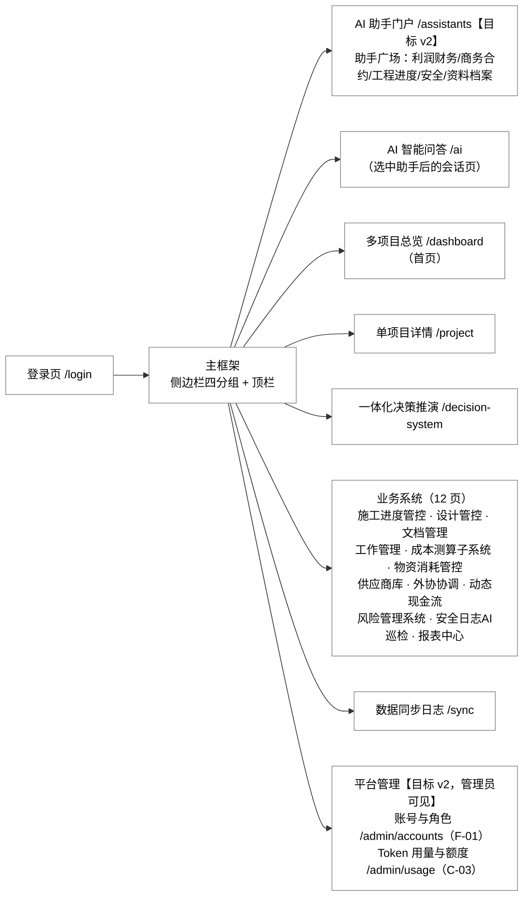
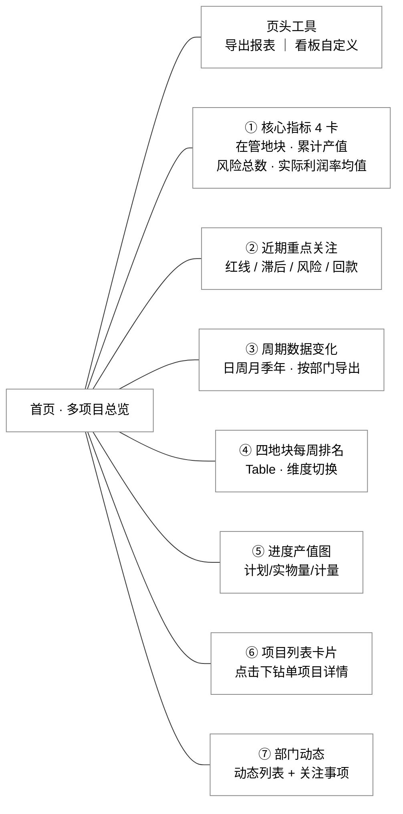
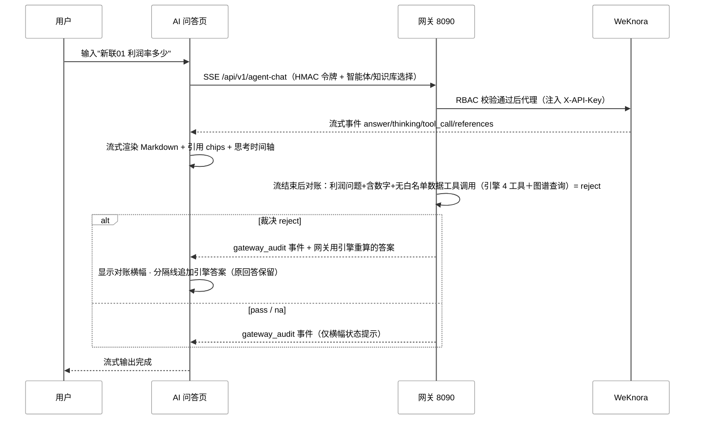

# 黄埔城更数字沙盘 · UI 与功能设计

| 版本 | v2（MaaS 平台版）｜ 日期 | 2026-09-20 ｜ 前端基线 | huangpu-react（React 19 + antd 6.6.0，橙色主题）｜ 配套 | 《系统架构-后端 v2.0》《数据结构设计 v1.0》《PRD v3.0》|
|---|---|---|---|---|---|

**v2 变更（对齐报价 v0.4·集团 MaaS）**：新增 AI 助手门户（§3.7，对应 B-01/B-03）、平台管理页（§3.8：账号角色 F-01、Token 用量 C-03）、全局额度状态与熔断呈现（§3.9、§5）；来源徽章扩展 MaaS/额度状态；手机端补充小程序 vs H5 形态决策（§1）。模型层切集团 MaaS 不改变页面结构，仅改变状态来源。

**口径说明**：页面结构、模块内容、交互均按 huangpu-react 现状源码整理（附文件路径），区分【现状】与【目标】——"目标数据源"列标注 mock → 真实接口的升级路径。整体换肤已被两次否决，本文不涉及视觉重构。

## 1. 页面信息架构

【现状】单页应用，路由唯一来源 `src/App.tsx`（L35-71），登录后落地 `/dashboard`。侧边栏一级菜单、无二级，按四个分组组织（`src/layouts/AppLayout.tsx` L40-83）；菜单按角色 `user.nav` 过滤，AI 问答所有角色可见（`src/auth.tsx` L32-34）。

页面访问控制三层：未登录跳 `/login`（`RequireAuth`）；页面 key 不在角色 `user.nav` 内跳回 `/dashboard`（前端拦截）；真实的知识库/智能体/利润权限拦截在后端网关（见《系统架构-后端》§4.3）。

**手机端（管理层速查版，报价 A-02；形态实施前确认 [NEED 负责人 M0]）**：独立于上述 Web 路由树，面向"领导手机上看数"，仅四块只读能力——

| 手机端页面 | 内容 | 数据来源 |
|---|---|---|
| 首页指标卡 | 多项目核心指标（利润率/产值/进度/预警数）＋周排名 | 网关现有 API 复用 |
| 单项目速查 | KPI 摘要＋现金流简表＋里程碑进度条（只读） | 网关现有 API 复用 |
| AI 问答 | 纯文本问答（SSE 流式，无附件/推演面板），引用徽章与额度状态简化版 | `/api/v1/agent-chat`（SSE chunked 适配） |
| 登录 | 微信授权/统一认证登录换取网关 HMAC 令牌（登录态映射），RBAC 复用服务端拦截 | 网关 `/api/auth/*` |

形态两案（报价 A-02 明确"H5/小程序实施前确认"）：

| 维度 | 方案一：微信小程序（推荐） | 方案二：H5（快速备选） |
|---|---|---|
| 体验 | 原生组件、可推送、可留存桌面 | 浏览器内访问，体验略弱 |
| 上线前置 | 注册主体＋政务/工具类目资质＋域名备案＋SSL，周期较长 | 域名备案＋SSL 即可，开发上线快 |
| 技术形态 | uni-app/Taro 单代码库（可扩展企业微信/支付宝） | 响应式 H5，与电脑端共享构建或独立轻页 |
| AI 流式 | SSE chunked 需小程序端手写适配 | 浏览器原生 SSE，复用电脑端逻辑 |
| 适用 | 长期正式渠道 | 先行试点/资质办理期过渡 |

桌面端重交互页（成本测算编辑、甘特图、推演、文档管理、平台管理）**不进手机端**。共同前置条件：网关公网 HTTPS（域名＋备案＋SSL），暴露面需负责人书面批准——详见《成本估算 v5.0》§6.5。

## 2. 首页（多项目总览 /dashboard）模块设计

【现状】首页 = 工作台，`src/pages/Dashboard.tsx`，数据全部来自写死 mock（`src/data/mock-data.ts`），无接口调用。模块自上而下按渲染顺序排列（L219-456），支持"看板自定义"隐藏模块（配置存 localStorage）。

页面模块结构图（左右树：连线表示"页面—模块"的包含关系，非流程；各模块完整内容见下方逐模块定义表）：

逐模块定义——每个模块里面放什么：

| # | 模块 | 里面放什么 | 交互 | 数据现状 → 目标 |
|---|---|---|---|---|
| ① | 核心指标卡 ×4 | 在管地块数、累计产值、风险总数、实际利润率均值 | 无 | mock `projects` → 地块台账接口 |
| ② | 近期重点关注 | 四类异常标签列表：跌破红线、进度滞后、红色风险、回款率异常，标注所属地块 | 无（由指标派生） | mock 派生 → 引擎挣值预警（SPI/CPI/VAC 超阈值） |
| ③ | 周期数据变化 | 日/周/月/季/年粒度切换 + 该粒度下的指标小卡 | 粒度切换；按部门导出 CSV（真实可用） | mock `periodReports` → 台账快照接口 |
| ④ | 四地块每周排名 | 排名 Table，维度 Segmented 切换 | 切换对比维度 | mock `weeklyRanking` → 台账 |
| ⑤ | 进度产值图 | 计划产值/实物量/计量三系列柱状图 | 无 | mock `outputValue` → 产值台账 |
| ⑥ | 项目列表卡片 | 四地块卡片（新联01 等），点击下钻 | 点击进单项目详情 | mock → 台账；下钻跳转待修（见 §5） |
| ⑦ | 部门动态 | 各部门动态列表 + 关注事项 | 无 | mock `periodReports.byDept` → 工作管理 |
| 页头 | 工具按钮 | 导出报表（前端生成 CSV，真实）、看板自定义（模块显隐开关，localStorage 持久化） | — | — |

首页**不设**全局 AI 浮窗：AI 入口收敛为侧边栏"/ai + 推演页内嵌面板"两处。理由：前端无全局项目/地块状态（见 §4），浮窗自动携带上下文需天级改造且收益仅省几个字，与用户直接进 /ai 提问无差别——该功能已决策砍掉。

## 3. 业务页面功能设计

### 3.1 AI 智能问答 /ai（系统核心页）

`src/pages/AiAssistant.tsx`。三栏结构：左侧会话栏、中部消息区、底部输入区。

**左侧会话栏**：新建/删除/切换会话；按用户名 localStorage 持久化（`hp-ai-sessions-<用户名>`）；切换会话时从服务端回放历史消息，未完成的消息自动续流。

**消息区**——每条 AI 回答的组成元素：

| 元素 | 内容 | 实现位置 |
|---|---|---|
| Markdown 渲染 | GFM / KaTeX 公式 / highlight.js 代码高亮 / Mermaid 图（与 WeKnora 渲染对齐） | `components/MarkdownView.tsx` |
| 思考过程时间轴 | thinking 多轮 + tool_call/tool_result 配对展示 | `components/ThinkingPanel.tsx` |
| 引用溯源 chips | 点击开 Drawer 查看来源文档与片段 | AiAssistant L680、L709-711 |
| 来源徽章（v2 扩展） | 正常"MaaS 在线 · RAG 回答"；MaaS 故障切备用端点时"备用模型"；额度熔断时"只读模式 · 本地引擎数值"；RAG 整体不可用时"本地演示引擎"。状态来自网关 SSE 事件与额度接口（§3.9） | L661（现状为"RAG 在线/本地演示引擎"两态） |
| 对账裁决横幅 | 网关 gateway_audit=reject 时显示，并自动追加引擎兜底答案 | L409-415、L662 |
| 断线续流 | 流中断后"继续生成"（continue-stream 接口） | L539-567 |
| 重新生成 | 空回答时可用 | L488-536 |
| Artifact 产物 | 产物列表与下载 | `services/artifact-service.ts` |

**输入区**：智能体选择（AgentPicker，按角色过滤）、附件上传（≤5 个、单个 20MB，上传后轮询解析状态）、知识库文件夹勾选（KnowledgeFolderPicker）、发送/停止生成（abort SSE + 通知后端 stop）。欢迎页提供 6 个快捷问题按钮。

**网络行为**【现状】：SSE 手工解析 8 类事件（answer/references/thinking/tool_call/tool_result/gateway_audit/complete/stop，`src/services/rag.ts` L306-412）；90 秒空闲看门狗（非总时长）；统一入口 `chatWithRag` 远端优先，RAG 未就绪或流失败时降级本地引擎（`chat-service.ts` L71-141）。

### 3.2 单项目详情 /project

`src/pages/ProjectDetail.tsx`。顶部项目 Select + "可编辑"开关；KPI 4 卡；以下 8 个 Tab（数据全 mock）：

| Tab | 内容 |
|---|---|
| 证照办理表 | 证照清单 |
| 施工计划与进度 | 设计进度表 + 里程碑 Timeline |
| 安全巡检与形象进度 | 巡检表 + Jarvis BIM iframe（外链）+ 航拍图分组（AI 标注、对比/上传按钮为演示假提示） |
| 风险管控 | 工程/经济/设计三列卡片 |
| 动态现金流 | 只读嵌入摘要 |
| 成本管控 | 三值对比表、成本构成条、超支 Top、结余项、物资预警表、分包付款台账 |
| 项目大事记 | 大事记列表（导出为假提示） |
| 产值与荣誉 | ECharts 饼图 + 创奖表 |

### 3.3 一体化决策推演 /decision-system

`src/pages/DecisionSystem.tsx`。推演类型 Segmented（整体/进度/成本）；红线/临界 Alert；**6 个扰动因子 Slider**（可重命名、改权重）；推演结果卡（利润率/进度/现金流 baseline→simulated）；六维雷达 + 维度柱图；快捷情景按钮（可重命名）；当前状态诊断；**AI 研判报告面板**——点击"解析情景并生成研判"调 `chatWithRag`，把本地引擎算出的数值注入 prompt、流式输出研判；失败时降级本地打字机输出。

引擎现状：前端独立实现 `decision-engine.ts`（演示脚手架）；目标：改调后端引擎 MCP `run_scenario`（见《系统架构-后端》§4.1、§4.4），保证与对话取数同一份算法。

### 3.4 其余业务页（12 页）

| 页面 | 核心模块 | 数据现状 |
|---|---|---|
| 施工进度管控 | 证照办理 / 计划与进度（里程碑 + **甘特图** + WBS + 设计出图进度）/ 产值计划与进度（三口径卡 + 月度图 + 产值明细表）/ 安全巡检与形象进度 | mock；Excel 导入导出为假按钮 |
| 设计管控 | 地块+项目双选择、4 统计卡、五阶段卡片、设计变更台账、各项目偏差率对比图 | mock |
| 文档管理 | **真实接口页**：左侧知识库树（增删改）+ 右侧文件表（解析状态/预览/移动/删除）+ 上传 + "管理知识库"外链 WeKnora 后台 | RAG 未连接时降级为演示表 |
| 工作管理 | 日/周/月/季汇报 4 表 + 通知单 + 规章制度 | mock；按钮多为演示 |
| 成本测算子系统 | 5 Tab：工程审核对比（**分部分项清单可编辑审核量价并自动重算**——真实计算）、三算对比（目标 vs 实际利润率图）、实际成本清单（分包/材料/中标三选一）、成本测算汇总、价格指标库 | mock 底表 + 前端真重算 |
| 物资消耗管控 | 4 指标卡 + 预算/采购/消耗对比（偏差列计算）+ 消耗趋势图 | mock；导出预警报告为假 |
| 供应商库 | 专业劳务 + 材料设备两张大表、搜索过滤、可编辑开关（默认开） | mock |
| 外协协调 | @提醒输入区 + 协调事项 Table | mock；@不落库 |
| 动态现金流 | 月度明细（可编辑开关）+ 6 月临界预警 Alert + 实际 vs 预测折线（临界 markLine）+ 敏感性分析 + 支出结构堆叠柱 + 分项目表 | mock |
| 风险管理系统 | 4 统计卡 + 红黄蓝过滤 + 项目风险分布条形 | mock |
| 安全日志 AI巡检 | **真实 AI 页**：直连本地 FastAPI + YOLOv8 PPE（:8765）——健康检测提示、拖拽传图、识别结果（标注图/人数/隐患数/隐患记录）、写入隐患 + 整改登记、巡检历史 | 真服务 |
| 报表中心 | 分类切换 + 报表 Table | mock；导出/解读为假 |

### 3.5 登录 /login

账号密码 + 短信验证码（演示写死 888888）+ 演示身份下拉（7 组网关账号）；提交走网关 `POST /api/auth/login`，网关不可用回退前端 mock 登录（演示容错）。

**生产形态**：登录走用户库（网关自有独立 PG 容器，users 表 user_id 主键），令牌载荷升级为 `{user_id, role, name, exp}`——审计与会话隔离对到"人"；7 组演示账号为 demo 形态。角色是权限模板（6 业务角色），用户是绑定角色的账号实例；详见《系统架构-后端》§2 接入层·用户库 与 PRD §3.8。

### 3.6 数据现状总原则

除 AI 问答、文档管理、安全巡检、登录外，页面数据全部来自 `src/data/` 写死 mock（`mock-data.ts` 1067 行、`cost-data.ts`、`suppliers-data.ts`）。**demo 数据不是业务事实**：字段、表名、数值口径不得当作系统 schema 依据，目标数据源按各页"数据现状 → 目标"列升级为台账接口 + 引擎 + 知识库。

### 3.7 AI 助手门户 /assistants（【目标 v2】，对应报价 B-01/B-03）

平台化的统一助手入口，解决"一个聊天框面对所有业务"的问题。侧边栏新增"AI 助手"一级菜单（原 /ai 变为选中助手后的会话页）。

| 区域 | 内容 | 交互 |
|---|---|---|
| 助手卡片网格 | 首批 5 个业务助手：利润财务（核心，含六因子推演/六红线/三算对比/现金流预警，跳转 /decision-system）、商务合约（三算对比、分包变更、合同条款）、工程进度（延误/EVM/工序资料）、安全（制度检索、巡检记录查询，无利润权限）、资料档案（项目文档/规范检索，联动文档管理） | 卡片显示名称、一句话职责、绑定知识库范围标签；点击进入该助手会话（/ai?agent=xxx） |
| 权限可见性 | 助手卡片按 RBAC 三约束过滤（安全员看不到利润财务助手；外协/工程看不到成本敏感助手） | 服务端返回可见列表，前端仅展示 |
| 通用能力条 | 文档总结、要点提取、报表解读、多轮追问（B-02）在每个助手会话内一致可用 | — |
| 最近使用/收藏 | 最近会话助手置顶 | localStorage |

数据来源：助手注册表（WeKnora 智能体 + 网关助手元数据，见《数据结构设计》§5.2）；各域助手问题清单 M1 需求确认会冻结（PRD REQ-12 [NEED]）。新增助手主要是 prompt/知识库绑定/场景调优，不新增引擎。

### 3.8 平台管理（【目标 v2】，管理员/负责人可见，对应 F-01/C-03）

两个页面，归入侧边栏"平台管理"分组（菜单按角色过滤，仅负责人/管理员可见）。

**3.8.1 账号与角色 /admin/accounts（F-01）**

| 模块 | 内容 |
|---|---|
| 用户列表 | 登录名/姓名/部门/角色/状态/最近登录；新增、停用、重置密码（对应 iam.users，见《数据结构设计》§2.1） |
| 角色与权限 | 六角色＋兜底角色的三约束只读/可配：知识库白名单 kbKeywords、智能体白名单、canAskProfit；变更留审计（对应 roles 表） |
| 手机端授权 | 微信 openid/统一认证账号映射状态查看、解绑 |
| 登录审计 | login_audit 流水（时间/端/IP/结果），可按人筛选 |

M2 前账号可沿用配置文件/初始化脚本，管理页是否纳入本期由 M2 评审定（历史遗留 [NEED]）；数据表 M2 一次性建好。

**3.8.2 Token 用量与额度 /admin/usage（C-03，REQ-13）**

| 模块 | 内容 |
|---|---|
| 总量概览 | 年度/月度额度总量、已用、剩余、预计耗尽日；70/90/100% 水位状态灯 |
| 趋势图 | 按日 Token 消耗折线（入/出堆叠），可切模型/能力（对话/嵌入/重排/文档理解） |
| 下钻分析 | 按部门、按人、按助手、按模型的用量排行表；可导出 CSV |
| 阈值与策略 | 展示当前阈值（70/90/100%）与熔断策略；续通审批入口（登记审批人、超额条款），写 quota_budget |
| 告警记录 | 70/90/100% 触发记录与通知状态 |
| 降级演练入口 | 手动模拟熔断，验证只读模式（配合 M2 降级演练） |

### 3.9 全局额度状态呈现（【目标 v2】）

- **顶栏状态点**：所有页面顶栏显示当前模型/额度状态小徽章（正常绿/MaaS 故障黄/额度预警橙/熔断红），hover 显示本月已用与水位；点击跳 /admin/usage（管理员）或显示本人用量（普通用户）。
- **AI 会话页**：输入区上方细条显示"本月额度已用 X%"；熔断（③'级）时输入框禁用、显示红色横幅"AI 生成额度已用尽，当前为只读模式：可检索知识库与查询利润数值，生成式问答待续通"，并保留引用检索与引擎数值问答可用。
- **手机端**：AI 问答页顶部同款简化徽章。
- 状态数据来自网关额度接口（周期累计/阈值），短时突发以 Redis 滑动窗口、持久账单以 maas_usage 为准（架构 §4.7、《数据结构设计》§6）。

## 4. AI 能力的页面呈现

**入口（v2 三处）**：①AI 助手门户 /assistants 选择业务助手进入会话（主入口，所有角色按权限可见）；②侧边栏"AI 智能问答"直达会话；③决策推演页内嵌"AI 研判报告"面板（含"在 AI 智能问答中深入提问"跳转）。

**地块上下文策略**：不做前端自动注入。源码事实：react 无全局项目状态（仅 `AuthContext`，每页各自 `useState(projectId)` 默认取第一个地块）。用户在问题里自然语言携带地块名（"新联01利润率多少"），检索过滤由智能体解析 + 元数据管道实现。

**可信呈现五件套**（AI 回答的每个数字都可核对出处、每次调用都可观测）：引用溯源 chips + Drawer、来源/模型徽章（含额度状态）、网关对账裁决横幅、思考过程时间轴、全局额度水位（§3.9）。

利润问答前端链路：

## 5. 全局状态与异常流

**全局状态**【现状】：仅 `AuthContext`（用户/登录态，`src/auth.tsx` L27）；项目选择为页面级状态，无全局地块上下文。localStorage 清单：

| key | 内容 |
|---|---|
| `hp-role` | 当前演示角色 |
| `hp-gateway-token` | 网关 HMAC 令牌（浏览器不持 WeKnora key） |
| `hp-ai-sessions-<用户名>` | AI 会话列表 |
| `huangpu-dashboard-modules` | 首页看板自定义配置 |
| `hp-assistant-recent`（v2） | 助手门户最近使用/收藏 |
| 额度状态（v2） | 仅缓存网关返回的水位用于徽章即时显示，权威值以服务端 /admin/usage 接口为准，不本地累计 |

**异常态**：

| 场景 | 页面呈现 | 位置 |
|---|---|---|
| RAG 未连接 | 文档页降级为演示表；AI 页降级本地引擎，来源徽章变"本地演示引擎" | Documents L246-289、chat-service L71-141 |
| 流中断/超时 | 90 秒空闲看门狗触发 → "继续生成"断线续流 | rag.ts L52-71、L456-502 |
| 对账 reject | 横幅提示 + 自动追加引擎兜底答案 | AiAssistant L409-415 |
| 安全 AI 未就绪 | 健康检测 Alert + 启动命令提示 | SafetyLog L225-245 |
| MaaS 故障（v2） | 徽章变"备用模型"（③级，经批准切备用端点）；长期不可用提示服务维护 | 网关 SSE/健康探测 |
| Token 额度熔断（v2） | 红色横幅＋输入框禁用，保留知识库检索结果与引擎数值问答（③'级只读模式）；续通后自动恢复 | 网关额度中间件（REQ-13） |
| 未登录 / 越权访问 | 跳 /login；越权页面跳 /dashboard；服务端 403 | App.tsx L23-33 + 网关 |

**现状待修清单**（演示不阻塞，列入迭代）：

1. 首页项目卡片下钻用 `window.location.hash='#/project'`——与 BrowserRouter 路由不匹配且不带项目 ID，下钻实为失效跳转（Dashboard.tsx L407）。
2. 各页"可编辑"开关只切换输入框展示态，不持久化（ProjectDetail L148-150 等）。
3. 一批演示假按钮：Excel 导入/导出、通知单操作、报表解读、航拍 AI 对比/上传等（各页 message 假提示）。
4. 顶栏搜索框、通知/帮助按钮为装饰无操作（AppLayout L286-326）。

## 6. 范围外

- 整体换肤 / 设计系统重构：不做（历史两次回滚），保留 antd 6.6.0 + 橙色主题。
- BIM 视图：外链 iframe 展示，非本系统功能范围。
- 浮窗自动携带地块上下文：不做（已决策，理由见 §2）。
- 安全巡检改造：不做（现状已是真 AI）。
- 手机端重交互（推演滑块/编辑/甘特/文档管理/平台管理）：不做，手机端仅管理层只读速查。
- 助手自由市场/用户自建助手公开：本期不做，首批助手由项目统一配置（B-03 打包范围）；WeKnora 自建智能体能力保留在知识库管理侧。
- 额度自助充值/计费：不做，超额走合同续通审批（报价 H-04 超额另行协商）。
