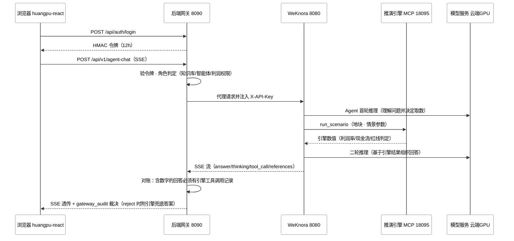

# 黄埔城更数字沙盘 · 系统架构设计（后端）

| 版本 | v1 ｜ 日期 | 2026-09-01 ｜ 配套文档 | 《UI与功能设计》｜ 状态 | 提请评审 |
|---|---|---|---|---|---|

**口径说明**：本文区分两类内容——【现状】指已核实仓库源码的运行事实（附文件路径）；【目标】指设计项，随里程碑落地。性能类数字（首字延迟、并发路数）一律以 M0 实测为准，本文不作纸面承诺。

## 1. 总体架构

平台由六部分组成：React 前端、微信小程序（管理层速查客户端）、Node 后端网关、WeKnora RAG 编排（Go）、推演引擎 MCP（Node）、GPU 模型服务（vLLM，云端租用）。数据与索引全部内网（知识库、台账、向量、图谱留在本地）；模型推理租用云端 GPU（AutoDL RTX PRO 6000 96GB 单卡），问答时仅检索上下文出内网，需负责人批准。

【现状】端到端链路（演示形态，已逐位验证）：

```
客户端：浏览器(huangpu-react) ／ 微信小程序（管理层速查）
   │  /api/v1/*（HMAC 令牌；小程序经公网 HTTPS）
   ▼
后端网关(:8090, Node) ── 认证 / 角色RBAC / 输出对账 / 审计（SSE 旁路监听工具调用）
   │ 用户库（独立 PG 容器：用户账号 / 登录态，网关自有库）
   │ 注入 X-API-Key（key 只存网关）
   ▼
WeKnora(:8080, Go+gin, Docker) ── PostgreSQL 17 + pgvector / Redis 7 + asynq / Neo4j 图谱
   │ ① LLM 推理（OpenAI 兼容接口）      ② MCP 工具调用（http-streamable）
   ▼                                        ▼
模型服务                              推演引擎 MCP(:18095, Node)
```

【目标】总体架构图（单机＋云端 GPU，2026-09-07 拍板推理上云）：

<svg xmlns="http://www.w3.org/2000/svg" width="1240" height="980" viewBox="0 0 1240 980" font-family="Segoe UI, Microsoft YaHei, sans-serif">
  <rect width="1240" height="970" fill="#ffffff"/>
    <rect x="60" y="30" width="520" height="90" fill="#ffffff" stroke="#8a8a8a"/>
  <text x="320" y="50" text-anchor="middle" font-size="13" fill="#333">客户端</text>
  <rect x="40" y="160" width="780" height="600" fill="#ffffff" stroke="#8a8a8a"/>
  <text x="430" y="182" text-anchor="middle" font-size="13" fill="#333">应用服务器（本地）</text>
  <rect x="70" y="455" width="720" height="280" fill="#ffffff" stroke="#8a8a8a"/>
  <text x="430" y="477" text-anchor="middle" font-size="13" fill="#333">WeKnora（Docker Compose）</text>
  <rect x="850" y="315" width="380" height="470" fill="#ffffff" stroke="#8a8a8a"/>
  <text x="1075" y="337" text-anchor="middle" font-size="13" fill="#333">云端 GPU（AutoDL 租用）</text>
      <rect x="80" y="58" width="210" height="52" rx="3" fill="#ffffff" stroke="#8a8a8a"/>
  <text x="185" y="78" text-anchor="middle" font-size="12.5" font-weight="bold" fill="#000">huangpu-react</text>
  <text x="185" y="98" text-anchor="middle" font-size="12.5" fill="#000">React 19 + antd 6.6.0</text>
    <rect x="350" y="58" width="190" height="52" rx="3" fill="#ffffff" stroke="#8a8a8a"/>
  <text x="445" y="78" text-anchor="middle" font-size="12.5" font-weight="bold" fill="#000">微信小程序</text>
  <text x="445" y="98" text-anchor="middle" font-size="12.5" fill="#000">管理层速查（uni-app）</text>
    <rect x="70" y="200" width="230" height="100" rx="3" fill="#ffffff" stroke="#8a8a8a"/>
  <text x="185" y="224" text-anchor="middle" font-size="12.5" font-weight="bold" fill="#000">后端网关 :8090</text>
  <text x="185" y="243" text-anchor="middle" font-size="12.5" fill="#000">Node 18+ 零依赖</text>
  <text x="185" y="262" text-anchor="middle" font-size="12.5" fill="#000">认证 · 角色RBAC</text>
  <text x="185" y="281" text-anchor="middle" font-size="12.5" fill="#000">输出对账 · 审计</text>
  <!-- 用户库圆柱（网关自有库，独立 PG 容器，WeKnora compose 之外） -->
  <path d="M193,345 v50 a52,10 0 0 0 104,0 v-50" fill="#ffffff" stroke="#8a8a8a"/>
  <ellipse cx="245" cy="345" rx="52" ry="10" fill="#ffffff" stroke="#8a8a8a"/>
  <text x="245" y="363" text-anchor="middle" font-size="12.5" font-weight="bold" fill="#000">PostgreSQL</text>
  <text x="245" y="381" text-anchor="middle" font-size="12.5" fill="#000">用户账号·登录态</text>
    <rect x="480" y="200" width="300" height="95" rx="3" fill="#ffffff" stroke="#8a8a8a"/>
  <text x="630" y="226" text-anchor="middle" font-size="12.5" font-weight="bold" fill="#000">推演引擎 MCP :18095</text>
  <text x="630" y="245" text-anchor="middle" font-size="12.5" fill="#000">MCP Streamable HTTP</text>
  <text x="630" y="264" text-anchor="middle" font-size="12.5" fill="#000">算法单源 engine.mjs</text>
    <rect x="480" y="325" width="300" height="100" rx="3" fill="#ffffff" stroke="#8a8a8a"/>
  <text x="630" y="349" text-anchor="middle" font-size="12.5" font-weight="bold" fill="#000">沙箱 · Cube</text>
  <text x="630" y="368" text-anchor="middle" font-size="12.5" fill="#000">Agent Skills 隔离执行</text>
  <text x="630" y="387" text-anchor="middle" font-size="12.5" fill="#000">（演示期用 WeKnora</text>
  <text x="630" y="406" text-anchor="middle" font-size="12.5" fill="#000">compose 沙箱服务）</text>
    <rect x="95" y="492" width="230" height="95" rx="3" fill="#ffffff" stroke="#8a8a8a"/>
  <text x="210" y="516" text-anchor="middle" font-size="12.5" font-weight="bold" fill="#000">WeKnora app :8080</text>
  <text x="210" y="535" text-anchor="middle" font-size="12.5" fill="#000">Go 1.26 + gin</text>
  <text x="210" y="554" text-anchor="middle" font-size="12.5" fill="#000">RAG 编排 · Agent 调度</text>
    <path d="M170,625 v58 a90,13 0 0 0 180,0 v-58" fill="#ffffff" stroke="#8a8a8a"/>
  <ellipse cx="260" cy="625" rx="90" ry="13" fill="#ffffff" stroke="#8a8a8a"/>
  <text x="260" y="662" text-anchor="middle" font-size="12.5" font-weight="bold" fill="#000">PostgreSQL 17</text>
  <text x="260" y="680" text-anchor="middle" font-size="12.5" fill="#000">ParadeDB + pgvector</text>
    <path d="M380,625 v58 a90,13 0 0 0 180,0 v-58" fill="#ffffff" stroke="#8a8a8a"/>
  <ellipse cx="470" cy="625" rx="90" ry="13" fill="#ffffff" stroke="#8a8a8a"/>
  <text x="470" y="662" text-anchor="middle" font-size="12.5" font-weight="bold" fill="#000">Redis 7</text>
  <text x="470" y="680" text-anchor="middle" font-size="12.5" fill="#000">asynq 任务队列</text>
    <path d="M590,625 v58 a90,13 0 0 0 180,0 v-58" fill="#ffffff" stroke="#8a8a8a"/>
  <ellipse cx="680" cy="625" rx="90" ry="13" fill="#ffffff" stroke="#8a8a8a"/>
  <text x="680" y="662" text-anchor="middle" font-size="12.5" font-weight="bold" fill="#000">Neo4j 2025.10</text>
  <text x="680" y="680" text-anchor="middle" font-size="12.5" fill="#000">知识图谱存储</text>
    <rect x="940" y="345" width="270" height="90" rx="3" fill="#ffffff" stroke="#8a8a8a"/>
  <text x="1075" y="371" text-anchor="middle" font-size="12.5" font-weight="bold" fill="#000">vLLM</text>
  <text x="1075" y="390" text-anchor="middle" font-size="12.5" fill="#000">Qwen3.8-27B FP8</text>
  <text x="1075" y="409" text-anchor="middle" font-size="12.5" fill="#000">RTX PRO 6000 96GB 单卡</text>
    <rect x="940" y="465" width="270" height="70" rx="3" fill="#ffffff" stroke="#8a8a8a"/>
  <text x="1075" y="494" text-anchor="middle" font-size="12.5" font-weight="bold" fill="#000">bge-m3 Embedding</text>
  <text x="1075" y="514" text-anchor="middle" font-size="12.5" fill="#000">1024 维</text>
    <rect x="940" y="565" width="270" height="70" rx="3" fill="#ffffff" stroke="#8a8a8a"/>
  <text x="1075" y="594" text-anchor="middle" font-size="12.5" font-weight="bold" fill="#000">bge-reranker-v2-m3</text>
  <text x="1075" y="614" text-anchor="middle" font-size="12.5" fill="#000">自托管 rerank 服务</text>
    <rect x="940" y="665" width="270" height="70" rx="3" fill="#ffffff" stroke="#8a8a8a"/>
  <text x="1075" y="694" text-anchor="middle" font-size="12.5" font-weight="bold" fill="#000">MinerU 文档解析</text>
  <text x="1075" y="714" text-anchor="middle" font-size="12.5" fill="#000">PDF / 图片结构化提取（GPU）</text>
    <g fill="none" stroke="#595959" stroke-width="1.3">
        <path d="M185,110 L185,197"/>
        <path d="M445,110 V150 H250 V197"/>
        <path d="M185,300 L185,489"/>
        <!-- 网关 → 用户库 -->
        <path d="M245,300 L245,335"/>
        <path d="M310,492 L310,247 L477,247"/>
        <path d="M325,505 L450,505 L450,375 L477,375"/>
        <path d="M325,540 H910"/>
    <path d="M910,390 V700"/>
    <path d="M910,390 H938"/>
    <path d="M910,500 H938"/>
    <path d="M910,600 H938"/>
    <path d="M910,700 H938"/>
        <path d="M230,587 L230,609"/>
    <path d="M280,587 L280,603 H470 L470,609"/>
    <path d="M310,587 L310,595 H680 L680,609"/>
  </g>
    <text x="193" y="162" font-size="12" fill="#595959">HMAC 令牌</text>
  <text x="310" y="162" font-size="12" fill="#595959">公网 HTTPS</text>
  <text x="193" y="435" font-size="12" fill="#595959">注入 X-API-Key</text>
  <text x="322" y="320" font-size="12" fill="#595959">MCP http-streamable</text>
  <text x="462" y="490" font-size="12" fill="#595959">Skills 隔离执行</text>
  <text x="560" y="528" font-size="12" fill="#595959">模型推理调用</text>
    <g fill="#595959">
    <polygon points="185,197 181,189 189,189"/>
    <polygon points="250,197 246,189 254,189"/>
    <polygon points="185,489 181,481 189,481"/>
    <polygon points="245,335 241,327 249,327"/>
    <polygon points="477,247 469,243 469,251"/>
    <polygon points="477,375 469,371 469,379"/>
    <polygon points="938,390 930,386 930,394"/>
    <polygon points="938,500 930,496 930,504"/>
    <polygon points="938,600 930,596 930,604"/>
    <polygon points="938,700 930,696 930,704"/>
  </g>
</svg>
算力与部署职责（2026-09-07 拍板：推理上云，本地仅一台）：

| 位置 | 承载 | 说明 |
|---|---|---|
| 云端 GPU（AutoDL 租用，RTX PRO 6000 96GB 单卡） | vLLM（LLM）、bge-m3（Embedding）、bge-reranker-v2-m3（Rerank）、MinerU（文档解析） | 单卡 96GB 免流水线并行；按量计费（工作日 8h 约 ¥1.4 万/年）；问答时仅检索上下文出内网，知识库/台账/索引全部留在本地 |
| 应用服务器（本地） | WeKnora 全套容器（含 Neo4j）、后端网关、推演引擎 MCP、前端静态托管 | CPU 服务器即可（16核/64GB 级），无 GPU 依赖；数据不出内网 |

设计原则（后端架构的四个不变量）：

1. **数值铁律**：利润/进度/现金流数值 100% 由确定性引擎计算，大模型只做理解和表述，禁止自算。
2. **权限强制在服务端**：前端 `rbac.ts` 只做界面过滤（可被篡改），知识库/智能体/利润权限的真实拦截在网关。
3. **数据内网、推理上云**（2026-09-07 修订）：知识库、台账、向量与图谱数据全部本地；模型推理租用云端 GPU（AutoDL RTX PRO 6000 96GB），问答时仅检索上下文出内网，需负责人批准。
4. **环境硬分界**：纯演示允许 Docker/本地进程；研发、测试、生产一律 Cube 沙箱。

## 2. 技术栈清单

| 层 | 组件 | 选型与版本 | 说明 | 源码依据【现状】 |
|---|---|---|---|---|
| 接入层 | 后端网关 | Node ≥18，原生 `node:http`，**零 npm 依赖** | 单文件起服务（`server.mjs`），无 express/fastify | `huangpu-gateway/server.mjs` L14-38 |
| 接入层 | 认证 | HMAC-SHA256 令牌，12 小时有效 | `/api/auth/login`、`/api/auth/me`；`/api/v1/*` 全部验令牌 | `huangpu-gateway/lib/auth.mjs` |
| 接入层 | 用户库【目标】 | 独立 PostgreSQL 容器（网关自有库，WeKnora compose 之外） | 生产用户账号/登录态唯一事实源；users 表（user_id 主键/姓名/角色/状态），令牌载荷升级为 `{user_id, role, name, exp}`；demo 现状为 7 组硬编码账号【data：`huangpu-gateway/lib/auth.mjs`】；会话隔离经网关注入 `X-External-User-ID`（WeKnora 现成能力，零改码）【data：`weknora-local/internal/types/session.go`、`internal/middleware/auth.go`】 | 项目既定决策（2026-09-09 拍板新库存放） |
| 编排层 | WeKnora app | Go 1.26 + gin v1.12.0 + gorm v1.31.1 | 腾讯 WeKnora v0.7.2 | `weknora-local/go.mod`、`VERSION` |
| 编排层 | 向量检索 | PostgreSQL 17（ParadeDB 镜像）+ pgvector-go v0.3.0，`RETRIEVE_DRIVER=postgres` | ES 驱动（v7/v8）已内置默认不启用，可按需切换 | `docker-compose.yml` L516-535、`.env` |
| 编排层 | 异步任务 | Redis 7 + asynq v0.26.0 | 文档解析等异步作业 | `go.mod`、compose L537-542 |
| 编排层 | 图数据库 | Neo4j 2025.10.1（WeKnora-neo4j 容器，compose 内置） | 知识图谱存储；`NEO4J_ENABLE` 总开关 + 知识库级"知识图谱"索引与实体关系抽取；7474 HTTP / 7687 bolt；图谱构建与检索验证为 M1 工作项【目标】 | `weknora-local/HANDOVER.md` L26、L184-186 |
| 编排层 | 对象存储 | 默认本地目录（`STORAGE_TYPE=local`）；MinIO 为可选 profile | 默认 compose 不启动 MinIO | `.env`、compose L597-617 |
| 编排层 | MCP 客户端 | mark3labs/mcp-go v0.52.0 | transport 支持 sse / http-streamable（stdio 因命令注入风险禁用）；MCPManager 管连接与鉴权 | `internal/mcp/client.go` L188-230、`internal/mcp/manager.go` |
| 模型层 | LLM 推理 | vLLM + Qwen3.8-27B FP8，部署于云端 GPU（AutoDL RTX PRO 6000 96GB 单卡，按量租用）【目标】 | 2026-09-07 拍板推理上云：单卡免 PP、原生 FP8，按量 ¥6.98/时；vLLM 对 Qwen3.8 混合注意力架构的支持待 M0 实测（验证与生产同卡型，结论直接迁移） | 项目既定决策 |
| 模型层 | Embedding | bge-m3，1024 维【目标】 | M0 起自托管 | 项目既定决策 |
| 模型层 | Reranker | bge-reranker-v2-m3 自托管【目标】 | WeKnora 检索参数 `rerank_top_k=30` | `weknora-local/config/config.yaml` |
| 模型层 | 文档解析 | MinerU【目标】 | PDF/图片结构化提取，GPU 推理，供知识库入库管道调用；部署形态（WeKnora docreader 服务或独立容器）M0 确定 | 项目既定决策 |
| 引擎层 | 推演引擎 MCP | Node + @modelcontextprotocol/sdk ^1.12.0 + zod ^3.25.0（仅两个依赖） | 4 个 MCP 工具；算法单源 `lib/engine.mjs`（258 行） | `huangpu-gateway/engine-mcp/package.json` |
| 前端 | huangpu-react | React 19.2 + antd 6.6.0 + Vite 8 + TS 6.0 + ECharts 6.1 + Mermaid 11.17 | 页面与功能详见配套《UI与功能设计》 | `huangpu-react/package.json` |

## 3. 服务与端口

| 服务 | 端口 | 形态 | 依据 |
|---|---|---|---|
| huangpu-react | 开发 5173；生产由网关/nginx 静态托管 | Vite 应用 | `vite.config.ts` |
| 微信小程序【目标】 | 微信平台分发（无需端口） | uni-app/Taro 客户端，经公网 HTTPS 域名访问网关（域名＋备案＋SSL） | 项目既定决策（2026-09-08 纳入架构） |
| 后端网关 | **8090**（`PORT` 可覆盖） | 宿主机 `node server.mjs` | `server.mjs` L38 |
| 用户库 PostgreSQL【目标】 | 5433（仅容器网络内，不与 WeKnora PG 5432 冲突） | 独立容器（应用服务器同机再起，非 WeKnora compose 成员） | 项目既定决策（2026-09-09）；端口为规划值，M2 落地时定版 |
| WeKnora app | **8080**（/health 健康检查） | 容器 | compose L37-56 |
| WeKnora frontend | 80（nginx 反代 app:8080） | 容器 | compose L8 |
| PostgreSQL 17 | 5432（仅容器网络内，未映射宿主机） | 容器 | compose L516-535 |
| Redis 7 | 6379（仅容器网络内） | 容器 | compose L537-542 |
| Neo4j 2025.10.1 | 7474（HTTP）/ 7687（bolt） | 容器（`NEO4J_ENABLE=true` 时随 compose 启动） | `weknora-local/HANDOVER.md` L26 |
| WeKnora 沙箱服务（演示） | profile: full 按需启用（WeKnora-sandbox 容器） | 容器 | compose L381-391；研发/测试/生产替换为 Cube |
| MinerU 文档解析【目标】 | 待定（云端 GPU 上，GPU 加速） | 容器或进程，M0 确定 | 项目既定决策 |
| 推演引擎 MCP | **18095**（0.0.0.0，`/mcp` + `/health`） | 宿主机 `node engine-mcp/server.mjs` | `engine-mcp/server.mjs` L18、167 |
| 安全 AI（现状） | 8765 | 宿主机 FastAPI + YOLOv8 PPE | `safety-ai-service.ts` L7 |
| MinIO（可选） | 9000/9001 | profile 启用，默认关闭 | compose L597-617 |

## 4. 核心机制

### 4.1 数值铁律与引擎单源

`huangpu-gateway/lib/engine.mjs` 是利润算法的唯一实现：六因子（`FACTORS`/`defaultFactors`）、基线（`getBaseline`）、情景推演（`simulate`）、挣值计算（`calcEarnedValue`）、预设情景（`PRESETS`）；数据常量（利润红线 16.66、现金流等）独立在 `lib/engine-data.mjs`。

两个服务端消费方 import 同一份代码：engine-mcp 的工具层（`engine-mcp/server.mjs` L15-16）与网关兜底出数（`lib/reconcile.mjs`），保证零漂移。前端另有一套读 mock 数据的本地降级实现（`src/utils/answer-engine.ts`、`decision-engine.ts`），属演示脚手架，生产降级路径以网关兜底为准。

### 4.2 输出对账（网关强制）

- 对账白名单【现状】只认 4 个引擎工具的调用记录：`run_scenario`、`get_baseline`、`get_current_status`、`list_presets`（`lib/reconcile.mjs` 的 `ENGINE_TOOL_RE`）。`knowledge_search` 命中不算。
- 图谱查询纳入白名单【目标】：Neo4j 图谱检索作为第 5 个可识别的数据工具调用计入对账，命中可佐证回答具有数据来源；对账仍不比对数字内容，数值铁律不变——图谱提供关系与上下文，确定性数值仍以引擎为唯一来源。
- 三值裁决：**pass**（含数字回答有引擎调用记录）/ **reject**（含数字但无引擎调用，判定模型编造——拒收回答并退回引擎兜底出数）/ **na**（不含数字的回答）。
- 裁决结果以 SSE 事件 `gateway_audit` 回传前端展示横幅；reject 时该事件携带网关用引擎重算的完整答案（`formatEngineAnswer`），前端以分隔线追加在原回答之后——原回答不移除，对账只判流程完整性、不比对数字内容，数字内容正确性由评测集逐位比对把关。
- 演示链路已做逐位验证：问"新联01利润率"，引擎输出 19.59→18.46，AI 回答数字与引擎结果逐位一致。

### 4.3 认证与角色权限

- 登录签发 HMAC-SHA256 令牌（12h）；`/api/v1/*` 一律验令牌（`lib/auth.mjs`）。小程序端经微信授权登录换取网关令牌（登录态映射），RBAC 三约束复用同一套服务端拦截。
- 服务端 RBAC（`lib/rbac.mjs`）覆盖 **6 个业务角色 + 1 个全权限测试账号**，每个角色约束三件事：
  - 可检索知识库（`kbKeywords` 白名单，如指挥长仅"项目/现金流"两库，商务部 `*` 全库）；
  - 可用智能体（内置智能体按 ID 白名单；自定义智能体按名称关键词匹配——因 WeKnora 生成的智能体 ID 在知识库重建后会漂移）；
  - 能否问利润（`canAskProfit`）：安全员为 `false`，利润问题在网关直接 403。
- 未识别角色落入 FALLBACK 最低权限（最低权限智能体 + 不可问利润）。
- API key 边界（源码核实）：WeKnora 的 tenant API key 只能限定知识库范围（`TenantAPIKey.KnowledgeBaseIDs`，`internal/types/tenant_api_key.go`），**限不了会话使用哪个 Agent**。因此浏览器不持 WeKnora key：key 只存网关 `.env`，每次上游调用由网关注入 `X-API-Key`；Agent 级白名单由网关强制。

### 4.4 MCP 集成

- 引擎侧（engine-mcp）：Streamable HTTP 无状态传输、`/mcp` 路径、`X-API-Key` 自鉴权、bind 0.0.0.0:18095；4 个工具 `run_scenario`（利润情景推演）、`get_baseline`（地块基线指标）、`get_current_status`（现状诊断）、`list_presets`（预设情景）。
- WeKnora 侧：`MCPManager` 管理连接（`internal/mcp/manager.go`），`mcp_services` 表持久化配置（transport_type/url/headers/auth_config，JSONB，`migrations/000001_agent.up.sql` L263-280）；MCP 工具注册进 Agent 工具列表，Agent 对话中按需调用。
- 网络放行：WeKnora 容器经 `host.docker.internal:18095` 访问宿主机引擎，SSRF 白名单与 `NO_PROXY` 已配置（`weknora-local/.env` L718-754）。

### 4.5 降级链

| 故障 | 降级行为 | 实现位置【现状】 |
|---|---|---|
| 推演引擎不可用/对账 reject | 网关 `formatEngineAnswer` 本地出数（与 MCP 同源零漂移） | `lib/reconcile.mjs` L37-80 |
| 云端 GPU 不可用（实例停机/欠费/平台故障） | 实例数据保留，重新开机即恢复（按量关机不计费）；紧急时批准切 OpenAI 兼容云端 API 端点兜底（演示期以 mimo-v2.5 验证过该通路） | AutoDL 数据保留规则、WeKnora 模型配置 |
| RAG 服务整体不可用 | 前端 `ragReady()=false`，走本地演示引擎（读 mock，仅演示形态） | `chat-service.ts` L71-141 |

### 4.6 审计

网关以 JSONL 落 `logs/gateway-audit.jsonl`（`server.mjs` L53-61），覆盖登录、代理调用、对账裁决。目标形态要求可追溯"谁、何时、问了什么、调了哪些工具、对账结论"；WeKnora 侧沿用其会话记录。

## 5. 关键链路：利润问答时序



两次 LLM 调用 + 一次引擎调用 + 全程流式。演示链路的逐位一致验证即沿此链路完成。

## 6. 部署形态与环境分界

| 环境 | 形态 | 说明 |
|---|---|---|
| 演示（现状） | 本机 Docker（WeKnora 容器组：frontend/app/postgres/redis/neo4j）+ 宿主机两个 Node 进程（网关、引擎 MCP）+ Vite 前端 | 唯一允许 Docker/本地进程的形态 |
| 研发 / 测试 / 生产【目标】 | 一律 Cube 沙箱（Agent Skills 沙箱后端，经 WeKnora「设置 → 沙箱后端」配置级切换，代码层零改动） | M2 完成采购部署（与应用共享一台服务器），M3 上线前完成切换 |

M0 待实测清单（本文所有未定参数的出处）：

1. vLLM 对 Qwen3.8 混合注意力架构（Gated DeltaNet）的支持版本与锁定方式——当前最危险假设，退路 SGLang / BF16 / 换 H20 96GB 云实例（同平台换卡，分钟级）。
2. 首字延迟与并发路数（单卡 96GB 无 PP，KV 池约 60GB 对应的实际并发）。
3. bge-m3 与 bge-reranker-v2-m3 自托管的资源占用与延迟。
4. MinerU 文档解析在 GPU 机上的资源占用与解析吞吐（扫描件为主的台账场景）。

## 7. 边界

- 前端页面与功能设计见配套《UI与功能设计》，本文不重复。小程序功能范围＝管理层速查（指标卡/单项目 KPI/现金流简表/周排名/纯文本 AI 问答），桌面重交互页不进小程序；小程序前置条件＝网关公网 HTTPS（域名＋备案＋SSL），暴露面需负责人批准（成本估算 §6.5）。
- 不做：安全巡检改造（现状已是真 AI，SafetyLog 页直连本地 YOLOv8 服务）、BIM/供应链系统对接、Wiki 检索与航拍摘要（试点后评估）。知识图谱（Neo4j）已纳入本体：图谱检索并入问答链路并计入对账白名单（§4.2）。
- 沙盘内嵌的 BIM iframe 为外链展示，不属于本系统功能范围。
